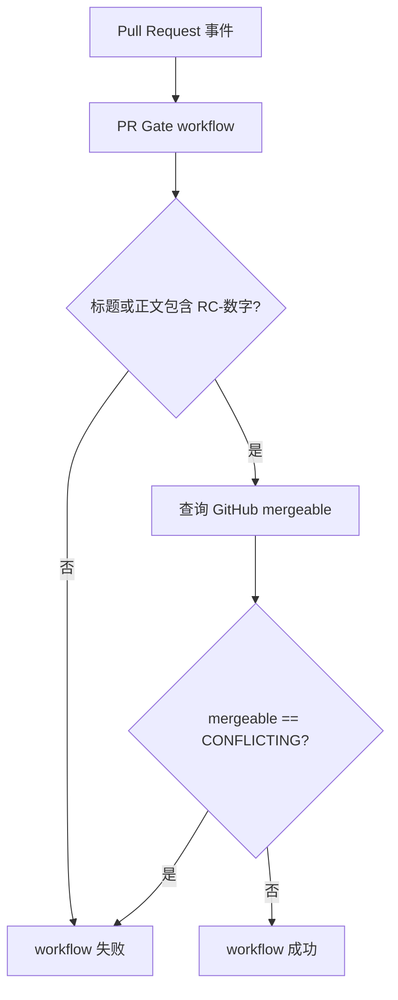
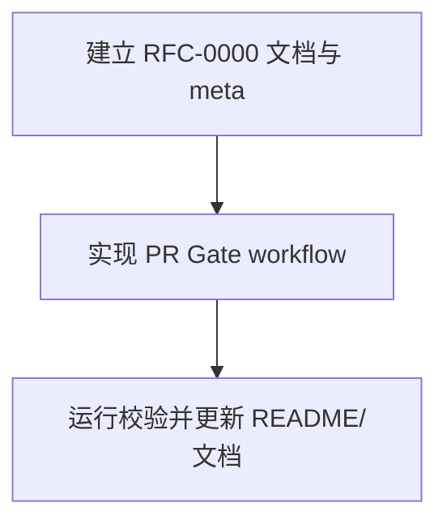

# RFC-0000: PR RC 编号与合并冲突门禁

## 摘要

本 RFC 定义项目 PR 的最低发布候选（RC）门禁：所有 Pull Request 必须在标题或正文中包含 `RC-数字` 编号，且 PR 与目标分支之间不能存在合并冲突。门禁通过 GitHub Actions 在 `pull_request` 事件上执行，失败时仅通过 workflow 状态和日志提示，不自动评论，避免引入额外的通知权限和评论噪声。

该门禁不替代项目已有的质量检查（安装、类型检查、lint、测试、build、禁止文件检查等），而是作为 PR 可进入评审和合并前的基础秩序约束。

## 动机

项目采用 PR-only merge 流程，任何代码合入 `main` 都必须通过 Pull Request。当前研发规则要求 PR 关联 RFC 或任务、通过 CI、由队友 Review 后合并，但没有机器可执行地检查：

1. PR 是否携带 RC 编号；
2. PR 是否已经与目标分支产生合并冲突。

缺少这两项检查会导致：

- release/submission 前难以快速筛选可发布候选；
- 评审开始前 PR 已经不可合并，浪费 Review 时间；
- 提交冻结期临近时才暴露冲突，增加现场风险。

## 设计

### 概述

新增一个 GitHub Actions workflow：`.github/workflows/pr-gate.yml`。

workflow 监听 Pull Request 的常见状态变化事件：

- `opened`
- `synchronize`
- `reopened`
- `edited`
- `ready_for_review`

workflow 只包含一个 job：`rc-number-and-conflict-gate`。

该 job 执行两类检查：

1. **RC 编号检查**：读取 PR 标题和正文，只要任意一处包含 `RC-数字` 即通过。
2. **合并冲突检查**：使用 GitHub CLI 查询 PR 的 `mergeable` 字段；当值为 `CONFLICTING` 时失败。

### 概念模型

| 概念 | 说明 | 所有权 |
|---|---|---|
| PR Gate | GitHub Actions 中执行的门禁集合 | `.github/workflows/pr-gate.yml` |
| RC 编号 | 形如 `RC-123` 的发布候选标识 | PR 作者维护在标题或正文 |
| 合并冲突状态 | GitHub 根据 head 与 base 计算的 `mergeable` 状态 | GitHub 平台维护 |
| 门禁结果 | workflow 成功或失败 | GitHub Actions 维护 |

### 关键设计决策

#### 决策 1：RC 编号允许出现在标题或正文

推荐默认值：标题或正文均可。

原因：

- 标题适合一眼识别；
- 正文适合承载更完整的 PR 模板；
- 兼容团队成员已有填写习惯；
- 不强制所有人立即调整 PR 标题格式，降低迁移成本。

#### 决策 2：发现冲突时直接失败

当 GitHub 判定 PR 与目标分支存在合并冲突时，workflow 直接失败。

原因：

- 冲突 PR 不应进入有效 Review 队列；
- 直接失败能尽早提醒作者更新分支；
- 与项目“CI 未通过的 PR 不得合并”的规则一致。

#### 决策 3：不自动评论

门禁失败时不自动在 PR 下评论，仅依赖 workflow 失败状态和日志。

原因：

- 实现更简单、更稳定；
- 避免为评论权限引入额外风险；
- 避免重复评论造成噪声；
- 当前项目没有要求自动通知机制。

#### 决策 4：门禁不替代质量 CI

本 RFC 只覆盖 RC 编号和冲突检查。项目已有的 `pnpm install / typecheck / lint / test / build`、Rust 检查、禁止文件检查等仍应由其他 CI workflow 或后续 RFC 子任务覆盖。

### 接口契约

#### GitHub Actions 输入

本 workflow 使用 GitHub Actions 内建上下文，不新增环境变量、密钥或人工输入。

| 字段 | 来源 | 用途 |
|---|---|---|
| `github.event.pull_request.title` | Pull Request 标题 | RC 编号检查 |
| `github.event.pull_request.body` | Pull Request 正文 | RC 编号检查 |
| `github.event.pull_request.number` | Pull Request 编号 | `gh pr view` 查询冲突状态 |
| `github.event.pull_request.base.ref` | 目标分支名 | 失败日志提示 |
| `github.event.pull_request.head.sha` | 当前 PR head SHA | workflow 上下文，可选保留 |
| `github.token` | GitHub Actions token | `gh pr view` 认证 |

#### RC 编号格式

正则：

```text
(^|[^A-Za-z0-9])RC-\d+(?![A-Za-z0-9])
```

通过示例：

- `RC-123`
- `feat(order): add cancellation flow RC-123`
- `feat(order): add cancellation flow (RC-123)`
- PR 正文中包含 `Release Candidate: RC-123`

不通过示例：

- `rc-123`
- `RC`
- `RC-abc`
- `RC-123A`
- `xRC-123`

#### 冲突检查输出

当冲突存在时，workflow 失败并输出：

```text
当前 PR 与 <base-ref> 存在合并冲突，无法通过门禁。
```

当冲突不存在时，workflow 输出：

```text
当前 PR 未检测到合并冲突。
```

## 架构图



## 权衡取舍

### 考虑过的替代方案

1. **只检查 PR 标题**
   - 优点：规则更严格，PR 列表上一眼可见。
   - 缺点：需要所有人立即调整标题习惯，迁移成本更高。
   - 结论：不采用。

2. **标题和正文都必须包含 RC 编号**
   - 优点：信息最完整。
   - 缺点：重复录入，容易出现标题和正文不一致。
   - 结论：不采用。

3. **冲突只 warning 不失败**
   - 优点：不会阻断 CI。
   - 缺点：冲突 PR 仍可能进入 Review 队列，无法达到门禁目的。
   - 结论：不采用。

4. **自动评论 PR 作者**
   - 优点：提示更明显。
   - 缺点：需要额外权限和去重逻辑，当前不是必需。
   - 结论：暂不采用。

### 缺点

- RC 编号没有与 GitHub Issue、RFC 或 release note 做自动关联，只检查格式。
- 冲突检测依赖 GitHub 对 `mergeable` 字段的计算，极端情况下可能需要等待或重新触发。
- 本 workflow 不检查 PR 是否关联 RFC，因为项目已有 PR 模板和 Review 规则，当前 RFC 范围只做 RC 编号与冲突门禁。

## 实现计划

### 阶段划分

1. 建立 RFC 目录与 RFC-0000 元数据；
2. 落地 PR Gate workflow；
3. 验证 workflow YAML、禁止文件规则和 Git 状态。

### 子任务分解

#### 依赖关系图



#### 子任务列表

| ID | 标题 | 依赖 | Ref |
|---|---|---|---|
| T1 | 建立 RFC-0000 文档与 meta | 无 |  |
| T2 | 实现 PR Gate workflow | T1 |  |
| T3 | 运行校验并更新 README/文档 | T2 |  |

#### 子任务定义

##### T1：建立 RFC-0000 文档与 meta

范围：

- 创建 `docs/rfcs/` 和 `docs/rfcs/meta/`；
- 编写 `docs/rfcs/0000-pr-rc-number-and-conflict-gate.md`；
- 使用 `ncoder rfc init` 创建 `docs/rfcs/meta/0000-pr-rc-number-and-conflict-gate.json`。

验收标准：

- RFC 文档存在且为中文；
- meta JSON 只能通过 `ncoder rfc init` 生成；
- 子任务数量不超过 6；
- 文档不含顶部状态元数据。

##### T2：实现 PR Gate workflow

范围：

- 新增 `.github/workflows/pr-gate.yml`；
- 检查 PR 标题或正文中的 `RC-数字`；
- 检查 PR 是否存在合并冲突；
- 失败时不自动评论。

验收标准：

- workflow YAML 可解析；
- PR 缺少 RC 编号时失败；
- PR 存在合并冲突时失败；
- 不引入真实密钥或生产环境变量。

##### T3：运行校验并更新 README/文档

范围：

- 验证 workflow YAML；
- 检查仓库未新增 `.js` / `.jsx` / `.mjs` / `.cjs` / `.py` 手写文件；
- 如 README 已有 CI/PR 说明，补充 RC 编号与冲突门禁说明。

验收标准：

- 校验命令通过；
- Git diff 只包含本 RFC 相关文件；
- README 或开发文档中能找到门禁规则。

### 影响范围

| 文件/模块 | 影响 |
|---|---|
| `.github/workflows/pr-gate.yml` | 新增 PR 门禁 workflow |
| `docs/rfcs/0000-pr-rc-number-and-conflict-gate.md` | 新增 RFC 设计文档 |
| `docs/rfcs/meta/0000-pr-rc-number-and-conflict-gate.json` | 新增 RFC meta |
| `README.md` 或 `docs/development-constitution.md` | 可选补充门禁说明 |

## 测试方案

### 静态校验

- 使用 YAML parser 验证 `.github/workflows/pr-gate.yml` 可解析；
- 使用 `find` 检查未新增禁止文件扩展；
- 使用 `git diff` 确认改动范围。

### GitHub Actions 场景测试

在真实 PR 中验证以下场景：

| 场景 | 期望 |
|---|---|
| PR 标题包含 `RC-123`，无冲突 | workflow 成功 |
| PR 正文包含 `RC-123`，无冲突 | workflow 成功 |
| PR 标题和正文均无 RC 编号 | workflow 失败 |
| PR 有 RC 编号但存在合并冲突 | workflow 失败 |

## 未解决的问题

无。

## 参考资料

- `AGENTS.md`：PR-only merge、CI 与质量门禁、提交冻结规则；
- `docs/development-constitution.md`：PR 模板、CI 与质量门禁；
- GitHub Actions：`pull_request` 事件；
- GitHub CLI：`gh pr view --json mergeable`。
