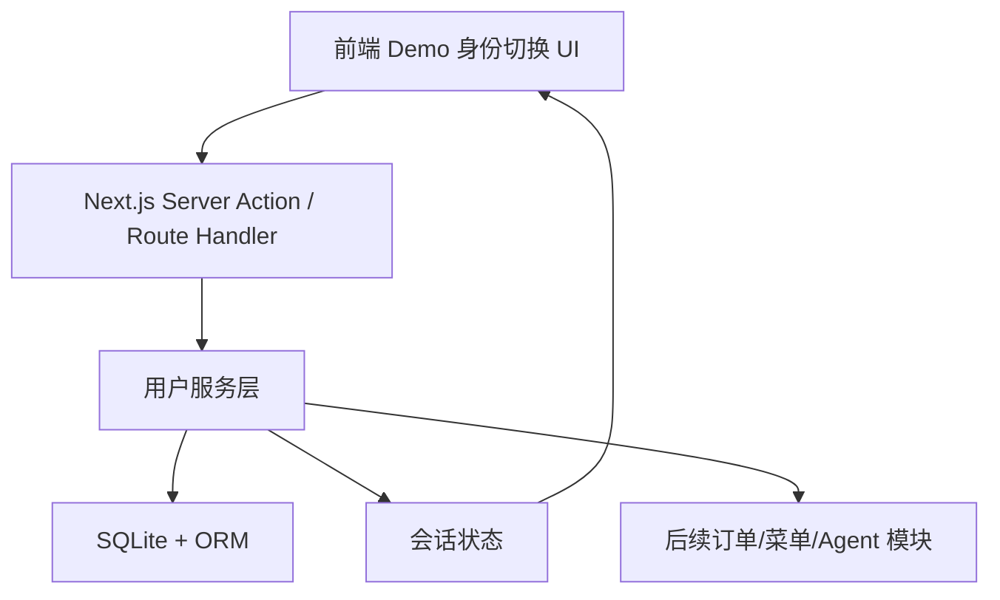
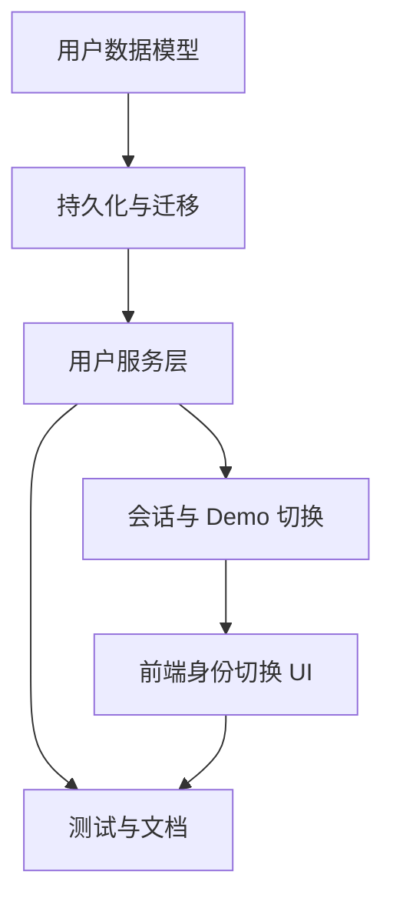

# RFC-0001: 用户系统

## 摘要

本 RFC 定义点餐系统的顾客端基础用户系统，用于在 Hackathon Demo 中支持“同一浏览器切换身份模拟三个角色”的用户体验。方案采用 Next.js App Router + TypeScript + SQLite + ORM，提供用户模型、角色、资料偏好、会话与 Demo 身份切换能力。

本 RFC 严格限定在用户系统：只做用户资料、角色、会话、Demo 身份切换、基础校验和测试计划；不做订单、菜单、Agent 意图、库存、支付、真实多端登录或真实账号体系。

## 动机

PRD 第 4 章“用户与场景”明确 Demo 中三个角色由同一浏览器切换身份模拟，且“不做真实多端登录”。同时，项目需要可演示用户参与点餐流程，因此用户系统需要解决以下问题：

1. Demo 中快速切换不同用户身份，展示顾客、管理员、成员等角色视角；
2. 为后续订单、菜单、Agent 约束记录等业务模块提供稳定的用户标识；
3. 在不做真实注册登录的前提下，保留用户资料、角色与偏好的扩展能力；
4. 避免 Agent 或前端绕过业务规则直接修改系统状态。

## 设计

### 概述

用户系统由四层组成：

1. **数据模型层**：定义用户、角色、用户偏好和会话记录；
2. **持久化层**：使用 SQLite 存储用户与会话数据，ORM 负责类型安全访问；
3. **服务端接口层**：通过 Next.js Route Handler 或 Server Action 提供用户列表、用户详情、创建/更新用户、切换会话等能力；
4. **前端交互层**：提供 Demo 身份切换入口，允许在同一浏览器中模拟不同用户。

### 关键设计决策

#### 决策 1：采用 Demo 身份切换，不实现真实注册登录

PRD 已明确“不做真实多端登录”和“不做用户账号体系”。因此本 RFC 不设计注册、密码、验证码、第三方 OAuth 或飞书登录。系统提供 Demo 身份切换能力，让用户在浏览器内选择已存在的用户身份进行模拟。

#### 决策 2：用户模型优先服务点餐 Demo

用户系统只保存与点餐 Demo 相关的基础信息：

- 用户标识；
- 昵称；
- 角色；
- 基础偏好，例如忌口、预算偏好、备注；
- 会话状态。

不保存支付信息、真实手机号、真实邮箱、地址等与当前 Demo 无关的敏感数据。

#### 决策 3：SQLite + ORM 作为持久化方案

SQLite 适合本地 Demo 与 Vercel 分支预览部署，且不需要外部数据库服务。ORM 用于保证数据访问类型安全，并为后续订单、菜单、Agent 约束模块复用数据层。

### 接口契约

#### 用户模型

- `User`：用户主体；
- `UserRole`：用户角色枚举；
- `UserProfile`：用户资料与偏好；
- `UserSession`：Demo 会话状态。

#### 角色模型

本 RFC 只定义顾客端基础角色，不扩展到管理员后台权限体系：

- `customer`：顾客角色；
- `admin`：仅用于 Demo 切换的管理员身份；
- `member`：多人点餐场景中的成员身份。

### 架构图

## 权衡取舍

### 考虑过的替代方案

1. **完整本地注册/登录**
   - 优点：用户系统更完整。
   - 缺点：超出 PRD 明确不做范围，且会增加 Demo 实现成本。
   - 结论：不采用。

2. **仅使用内存状态**
   - 优点：实现最快。
   - 缺点：刷新或部署后数据丢失，无法稳定演示。
   - 结论：不采用。

3. **接入飞书登录**
   - 优点：更贴近真实企业身份。
   - 缺点：依赖环境变量、权限与网络配置，不适合当前 Demo 范围。
   - 结论：不采用。

### 缺点

- 不是真实账号体系，不能表达真实登录态；
- 同一浏览器切换身份只是 Demo 模拟；
- 权限能力仅保留最小扩展点，不覆盖后台管理。

## 实现计划

### 阶段划分

1. 建立用户数据模型与持久化；
2. 提供用户服务与 Demo 会话能力；
3. 提供前端身份切换入口；
4. 补充测试与文档。

### 子任务分解

#### 依赖关系图

#### 子任务列表

| ID | 标题 | 依赖 | Ref |
|---|---|---|---|
| T1 | 用户数据模型 | - | - |
| T2 | SQLite 持久化与迁移 | T1 | - |
| T3 | 用户服务层接口 | T2 | - |
| T4 | Demo 会话与身份切换 | T3 | - |
| T5 | 前端身份切换 UI | T4 | - |
| T6 | 测试与文档 | T3, T5 | - |

#### 子任务定义

- **T1 用户数据模型**：定义用户、角色、偏好、会话类型。
- **T2 SQLite 持久化与迁移**：建立本地数据库和迁移脚本。
- **T3 用户服务层接口**：提供用户查询、创建、更新、删除与校验服务。
- **T4 Demo 会话与身份切换**：提供当前用户会话的读取与切换能力。
- **T5 前端身份切换 UI**：提供 Demo 身份切换界面。
- **T6 测试与文档**：补充类型检查、测试、README 与 Demo 脚本说明。

### 影响范围

- `app/app`：前端页面与 Demo 身份切换 UI；
- `app/package.json`：新增依赖与脚本；
- `app/tsconfig.json`：保持严格 TypeScript；
- `app/README.md`：补充用户系统 Demo 说明；
- `docs/rfcs/`：新增本 RFC。

## 测试方案

- 类型检查：`pnpm typecheck`；
- Lint：`pnpm lint`；
- 构建：`pnpm build`；
- 用户服务单元测试；
- 前端身份切换集成测试；
- Demo 脚本验证：切换顾客、管理员、成员身份。

## 未解决的问题

无。

## 参考资料

- PRD 第 4 章“用户与场景”
- `docs/development-constitution.md`
- `app/AGENTS.md`
