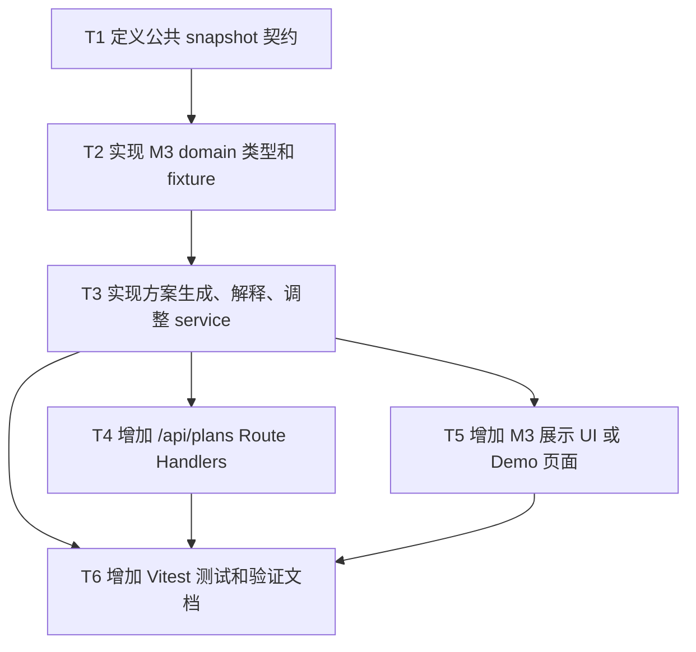

# RFC-0002: M3 方案生成与解释 Agent 模块

## 摘要

M3 负责把 M1/M2 已经整理好的菜单、预算、成员和忌口信息，转换成一个可展示、可解释、可调整的点餐方案。本 RFC 选择“TypeScript 规则优先、NAC 能力预留”的方案：第一版 M3 先用确定性 TypeScript 规则生成方案和解释，保证预算、硬忌口和成员覆盖不失控；NAC Agent 只作为后续增强解释和调整建议的可选入口，不参与写入菜单、需求、订单或库存。

本 RFC 只覆盖 M3 模块，不覆盖 M1 菜单组局、M2 OCR/需求解析，也不覆盖订单和库存执行。M3 的边界是：只消费 `PlanningInputSnapshot`，只输出 `PlanResult`、`ExplanationSnapshot` 和 `PlanDiff`。

## 动机

当前仓库已有 Potluck 概要设计，把三人协作拆成 M1、M2、M3 三个大模块。M3 对应 Epic 4、Epic 5、Epic 6：生成方案、解释方案、调整方案。

如果不把 M3 独立出来，容易出现三个问题：

1. M3 直接依赖 M1/M2 内部实现，导致三人并行开发互相阻塞；
2. 如果完全依赖 NAC Agent 生成方案，现场可能出现 JSON 格式不稳定、超预算、忽略硬忌口等风险；
3. 如果没有明确 API 和输出契约，后续页面 wiring 和后端规则层无法稳定接入。

因此需要一份 RFC 明确 M3 的输入输出、边界、实现拆分和验收方式。

## 设计

### 概述

M3 采用三层结构：

```text
PlanningInputSnapshot
  ↓
M3 TypeScript service：生成、解释、调整、diff
  ↓
PlanResult / ExplanationSnapshot / PlanDiff
```

NAC Agent 不在第一版主流程中直接生成最终方案，而是预留 adapter 接口。未来如果需要接入 NAC，可以在解释和调整建议阶段调用 NAC，由 TypeScript service 做最终校验和兜底。

### 概念模型

核心概念如下：

| 概念 | 说明 | 归属 |
|---|---|---|
| `MenuItem` | 菜单项，包含菜名、价格、品类、辣度、食材、过敏原标记等 | M1 输出，M3 只读 |
| `MealSession` | 组局信息，包含预算、人数、成员、优惠等 | M1 输出，M3 只读 |
| `Requirement` | 成员需求，包含忌口、偏好、硬软程度 | M2 输出，M3 只读 |
| `PlanningInputSnapshot` | M3 的输入快照，由 M1/M2 数据组装 | M3 输入契约 |
| `PlanResult` | M3 生成的方案结果，可能是成功方案或冲突结果 | M3 输出契约 |
| `ExplanationSnapshot` | 对方案选择、排除、预算、冲突的解释 | M3 输出契约 |
| `PlanDiff` | 调整前后的方案差异 | M3 输出契约 |
| NAC adapter | 后续可选接入 NAC 的接口，不影响第一版主流程 | M3 可选扩展 |

### 模块边界

M3 只做以下事情：

- 读取 `PlanningInputSnapshot`；
- 过滤违反硬需求的菜品；
- 在预算内生成点餐方案；
- 尽量让每个成员至少有一份能吃；
- 生成方案解释；
- 根据调整请求重算并输出差异；
- 预留 NAC 解释/调整建议 adapter。

M3 不做以下事情：

- 不创建、修改、取消订单；
- 不扣减或恢复库存；
- 不写入菜单；
- 不写入成员需求；
- 不调用 M1/M2 repository；
- 不把 NAC Agent 的自然语言输出当作唯一事实来源。

### 目录设计

M3 新增文件应集中在以下目录：

```text
app/src/contracts/snapshots.ts
app/src/plan-explanation-agent/
  domain/
    plan.ts
    planning-context.ts
    explanation.ts
    revision.ts
  service/
    generate-plan.ts
    explain-plan.ts
    revise-plan.ts
    diff-plan.ts
    plan-scoring.ts
  api/
    plan-routes.ts
  ui/
    plan-panel.tsx
  fixtures/
    planning-seed.ts
  tests/
    generate-plan.test.ts
    explain-plan.test.ts
    diff-plan.test.ts
app/app/api/plans/
  generate/route.ts
  explain/route.ts
  revise/route.ts
```

如果团队已有统一 `src` 目录，应优先放到 `app/src`，避免把业务逻辑散落在 Next.js page 目录下。

### 接口契约

#### `PlanningInputSnapshot`

M3 只消费这个输入快照：

```ts
type PlanningInputSnapshot = {
  menu: MenuItem[]
  session: MealSession
  requirementsByMember: Record<string, Requirement[]>
  strategy?: "balanced" | "cheap" | "coverage"
}
```

字段含义：

- `menu`：当前可用菜单；
- `session`：预算、人数、成员、优惠；
- `requirementsByMember`：每个成员的需求；
- `strategy`：方案策略，默认 `balanced`。

#### `PlanResult`

M3 输出方案结果：

```ts
type PlanResult =
  | { ok: true; plan: Plan }
  | { ok: false; conflicts: Conflict[]; suggestions: string[] }
```

成功时返回 `Plan`；失败时返回冲突和建议，不返回半成品方案。

#### `ExplanationSnapshot`

M3 输出解释快照：

```ts
type ExplanationSnapshot = {
  selectedReasons: SelectedReason[]
  memberRequirementStatus: MemberRequirementStatus[]
  excludedItems: ExcludedItemReason[]
  budget: BudgetExplanation
  conflicts: Conflict[]
}
```

解释内容必须来自输入快照和生成结果，不编造菜单、库存、订单状态。

#### `PlanDiff`

M3 输出调整差异：

```ts
type PlanDiff = {
  addedItems: PlanItem[]
  removedItems: PlanItem[]
  changedItems: PlanItemChange[]
  summary: string
}
```

调整请求至少支持：

```ts
type PlanChangeRequest =
  | { type: "remove_item"; dishId: string }
  | { type: "add_item"; dishId: string }
  | { type: "change_strategy"; strategy: "balanced" | "cheap" | "coverage" }
```

### API 设计

M3 第一版提供三个 Route Handler：

```text
POST /api/plans/generate
POST /api/plans/explain
POST /api/plans/revise
```

#### `POST /api/plans/generate`

职责：

1. 接收 `PlanningInputSnapshot`；
2. 使用 zod 校验输入；
3. 调用 M3 service 生成方案；
4. 返回 `PlanResult`。

不写入任何业务状态。

#### `POST /api/plans/explain`

职责：

1. 接收 `PlanningInputSnapshot` 和 `Plan`；
2. 校验输入；
3. 调用 M3 service 生成解释；
4. 返回 `ExplanationSnapshot`。

不写入任何业务状态。

#### `POST /api/plans/revise`

职责：

1. 接收 `RevisionInputSnapshot`；
2. 校验输入；
3. 根据调整请求重算方案；
4. 返回 `PlanResult` 和 `PlanDiff`。

不写入任何业务状态。

### NAC 预留设计

第一版不强制依赖 NAC。M3 内部预留一个可选 adapter 边界：

```text
NAC adapter interface
  ↓
解释/调整建议文本生成
  ↓
TypeScript service 校验并合并到 ExplanationSnapshot
```

NAC 只用于增强自然语言解释和调整建议，不直接生成最终 `Plan`。这样现场 Demo 可以先稳定运行 TypeScript 规则版，后续再接入 NAC 能力。

## 权衡取舍

### 方案一：TypeScript 规则优先，NAC 预留（本 RFC 采用）

优点：

- 第一版稳定，不依赖 NAC 可用性和输出格式；
- 预算、硬忌口、成员覆盖等规则可控；
- 便于单元测试；
- 不违反 Agent 边界；
- 后续可以平滑接入 NAC 解释和调整建议。

缺点：

- 第一版解释可能不如 NAC 生成的自然语言丰富；
- 需要手写规则和 fixture。

### 方案二：NAC 直接生成方案，TypeScript 只做兜底

优点：

- 自然语言表达更灵活；
- 调整建议可能更拟人。

缺点：

- JSON 格式可能不稳定；
- 可能忽略硬约束；
- Demo 风险更高；
- 测试成本高。

本 RFC 不采用该方案。

### 方案三：完全不接 NAC，只写纯规则

优点：

- 最简单；
- 不依赖外部 Agent 平台。

缺点：

- 无法体现项目“Agent 真正参与核心业务流程”的目标；
- 后续接入 NAC 时需要额外改造。

本 RFC 不采用该方案，但保留 NAC adapter 入口。

## 实现计划

### 阶段划分

1. 先定义公共 snapshot 契约；
2. 实现 M3 domain 类型和纯函数 service；
3. 增加 API Route Handler；
4. 增加本地 fixture 和 UI 展示入口；
5. 增加 Vitest 单元测试；
6. 补齐 README 和验证说明。

### 子任务分解

#### 依赖关系图



#### 子任务列表

| ID | 标题 | 依赖 | Ref |
|---|---|---|---|
| T1 | 定义公共 snapshot 契约 | 无 |  |
| T2 | 实现 M3 domain 类型和 fixture | T1 |  |
| T3 | 实现方案生成、解释、调整 service | T2 |  |
| T4 | 增加 `/api/plans` Route Handlers | T3 |  |
| T5 | 增加 M3 展示 UI 或 Demo 页面 | T3 |  |
| T6 | 增加 Vitest 测试和验证文档 | T3, T4, T5 |  |

#### 子任务定义

##### T1：定义公共 snapshot 契约

范围：

- 新增 `app/src/contracts/snapshots.ts`；
- 定义 `MenuItem`、`MealSession`、`Member`、`Requirement`、`PlanningInputSnapshot`、`RevisionInputSnapshot`、`PlanChangeRequest`；
- 不引入 M1/M2 内部实现；
- 只放类型和轻量 schema，不放业务逻辑。

验收标准：

- TypeScript 类型完整；
- 不 import M1/M2 业务实现；
- 字段与 `docs/potluck-overview-design.md` 的 M3 契约一致。

##### T2：实现 M3 domain 类型和 fixture

范围：

- 新增 `domain/plan.ts`、`domain/planning-context.ts`、`domain/explanation.ts`、`domain/revision.ts`；
- 新增 `fixtures/planning-seed.ts`；
- fixture 覆盖 4 人、预算 250、至少 6 道菜、猪肉忌口、花生过敏、辣度偏好等场景。

验收标准：

- fixture 可被 service 和测试复用；
- 数据结构稳定；
- 不依赖 Next.js runtime。

##### T3：实现方案生成、解释、调整 service

范围：

- 新增 `service/generate-plan.ts`；
- 新增 `service/explain-plan.ts`；
- 新增 `service/revise-plan.ts`；
- 新增 `service/diff-plan.ts`；
- 新增 `service/plan-scoring.ts` 用于策略排序；
- 实现硬需求过滤、预算检查、成员覆盖检查、策略排序、冲突输出。

验收标准：

- 不违反 hard requirement；
- 不超过预算；
- 每人至少有一份能吃；
- 预算不足或无法满足时返回 `ok: false`；
- service 为纯函数，可被单元测试直接调用。

##### T4：增加 `/api/plans` Route Handlers

范围：

- 新增 `app/app/api/plans/generate/route.ts`；
- 新增 `app/app/api/plans/explain/route.ts`；
- 新增 `app/app/api/plans/revise/route.ts`；
- API 只做 JSON 解析、zod 校验、调用 service、返回结果；
- 不写数据库、不改订单、不改库存。

验收标准：

- 三个 API 均可在本地启动后访问；
- 非法输入返回明确错误；
- 合法输入返回符合契约的 JSON；
- 不引入 `.js` 或 `.py` 文件。

##### T5：增加 M3 展示 UI 或 Demo 页面

范围：

- 新增 `ui/plan-panel.tsx` 或轻量 Demo 页面；
- 页面可以加载 `planning-seed.ts` 或调用 `/api/plans/generate`；
- 展示 PlanResult、ExplanationSnapshot 和 PlanDiff；
- 不直接修改菜单、需求、订单或库存。

验收标准：

- 用户可以在页面中看到方案、解释和调整差异；
- UI 不绕过 API/service 规则；
- 页面可被 Vercel Preview 构建。

##### T6：增加 Vitest 测试和验证文档

范围：

- 在 `app/package.json` 增加 `typecheck`、`test` 脚本；
- 新增 Vitest 配置；
- 新增 `generate-plan.test.ts`、`explain-plan.test.ts`、`diff-plan.test.ts`；
- 更新 README 或 Demo 文档，说明 M3 启动、测试、API 调用方式。

验收标准：

- `pnpm typecheck` 通过；
- `pnpm lint` 通过；
- `pnpm test` 通过；
- `pnpm build` 通过；
- 测试覆盖硬忌口、预算不足、成员覆盖、调整 diff 等关键场景。

### 影响范围

预计影响文件：

```text
app/src/contracts/snapshots.ts
app/src/plan-explanation-agent/**
app/app/api/plans/**
app/package.json
app/package-lock.json
app/tsconfig.json
app/vitest.config.ts
app/README.md
```

不应影响：

```text
app/app/page.tsx
app/app/layout.tsx
app/app/globals.css
nac/potluck-order-agent/**
```

## 测试方案

### 单元测试

使用 Vitest 覆盖：

1. `generate-plan`：正常预算内生成方案；
2. `generate-plan`：排除 hard requirement 菜品；
3. `generate-plan`：预算不足返回 `ok: false`；
4. `generate-plan`：成员覆盖检查；
5. `explain-plan`：生成选择理由、排除原因、预算说明；
6. `revise-plan`：移除菜品后重算；
7. `diff-plan`：输出 added/removed/changed 和 summary。

### 集成测试

通过 Route Handlers 验证：

- `POST /api/plans/generate` 合法输入返回 `PlanResult`；
- `POST /api/plans/explain` 合法输入返回 `ExplanationSnapshot`；
- `POST /api/plans/revise` 合法输入返回 `PlanResult` 和 `PlanDiff`；
- 非法输入返回 400 级别错误。

### 质量门禁

PR 必须通过：

```bash
pnpm install
pnpm typecheck
pnpm lint
pnpm test
pnpm build
```

如果使用 NAC adapter，也必须保证 NAC 不可用时 M3 主流程仍可运行。

## 未解决的问题

无。

## 参考资料

- `docs/potluck-overview-design.md`
- `AGENTS.md`
- `docs/development-constitution.md`
- `.agents/skills/nac/SKILL.md`
