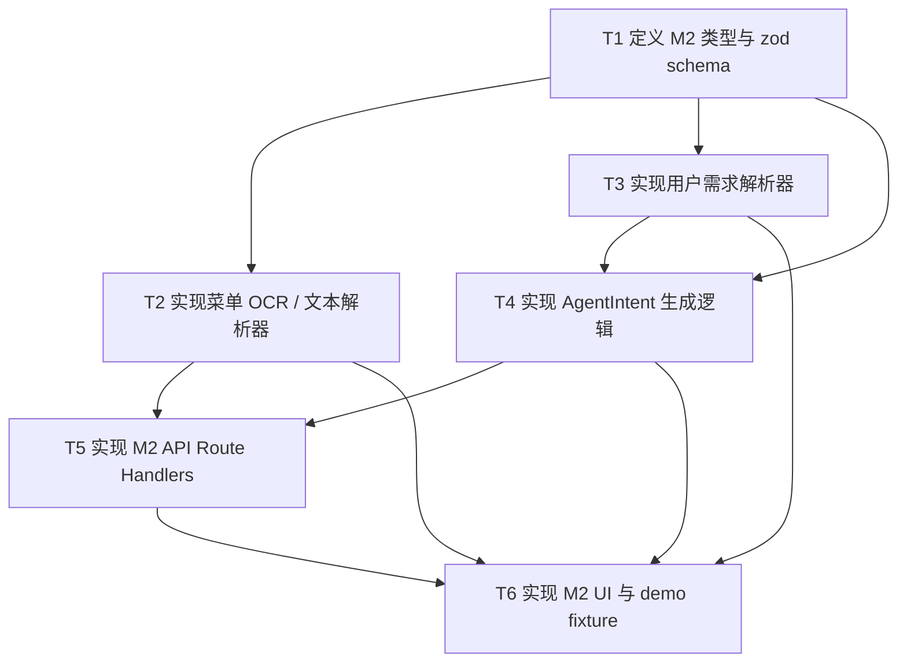

# RFC-0003: M2 OCR 与用户需求 Agent 模块任务拆解

## 摘要

本 RFC 只覆盖 Potluck 三大模块中的 **M2：OCR 与用户需求 Agent 模块**，目标是在不影响 M1（菜单与组局）和 M3（方案生成与解释）的前提下，把 M2 拆成可独立实现、可独立验证的子任务 DAG。

M2 的核心职责是把非结构化输入转成结构化候选：菜单图片/文本解析输出 `MenuCandidateSnapshot`，用户自然语言需求解析输出 `RequirementsSnapshot` 和 `AgentIntent`。M2 不维护真实菜单状态，不写需求持久化状态，不生成最终用餐方案，也不直接修改订单或库存。

本 RFC 采用保守可演示方案：菜单侧先实现稳定的文本解析，图片 OCR 先保留可替换占位；需求侧使用规则解析器 + `zod` schema；需求状态只输出候选，不持久化；前端只交付 M2 独立 UI 与 demo fixture。

## 动机

Potluck 概要设计将项目拆成三个大模块并行开发。M2 位于 M1 和 M3 之间：它既要把菜单输入转成候选供 M1 确认，又要把成员需求转成结构化快照供 M3 消费。如果 M2 边界不清，容易出现两类风险：

1. **Agent 越权**：M2 直接写菜单、需求、订单或库存，违反项目 Agent 行为边界。
2. **并行阻塞**：M2 与 M1/M3 互相依赖实现细节，导致三个人无法独立推进。

本 RFC 将 M2 明确限定为“解析与候选输出模块”，通过稳定 JSON 契约和 6 个子任务 DAG，让负责人 B 可以独立开工，同时不侵入其他人的模块。

## 设计

### 概述

M2 只处理输入到结构化候选的转换，不处理业务状态最终确认。

```text
菜单图片/文本
  ↓
M2 菜单解析器
  ↓
MenuCandidateSnapshot
  → 交给 M1 展示并由用户确认

用户自然语言需求
  ↓
M2 需求解析器
  ↓
RequirementsSnapshot + AgentIntent
  → 交给后端规则层/M1 确认是否写入需求
```

M2 与外部模块的关系：

```text
M2 OCR/Requirement Agent
  ├─ 输出 MenuCandidateSnapshot
  ├─ 输出 RequirementsSnapshot
  └─ 输出 AgentIntent
        ↓
M1：用户确认后写入菜单/需求状态
M3：消费 RequirementsSnapshot 生成方案
```

### 关键设计决策

#### 决策 1：M2-only 范围

本 RFC 只规定 M2 的类型、解析器、API、UI、fixture 和测试方案。M1 的菜单确认、组局状态、真实菜单写入，以及 M3 的方案生成、解释、调整，都不在本 RFC 的实现范围内。

原因：

- 避免影响 A 和 C 的并行开发；
- 避免把集成阶段的工作提前混入 M2；
- 保持 RFC 子任务数量可控。

#### 决策 2：菜单 OCR 采用“文本解析 + OCR 占位”

M2 先实现稳定的文本菜单解析。图片 OCR 先通过占位实现或 fixture 支撑 Demo，后续可在 parser 内部替换真实 OCR 能力，但不改变 `POST /api/ocr/extract-menu` 的输入输出契约。

原因：

- 文本解析稳定、可测、不依赖外部服务；
- 真实 OCR 会引入密钥、部署和失败处理风险；
- Demo 可以先用菜单文本或模拟图片结果完成闭环。

#### 决策 3：需求解析采用规则解析 + zod schema

用户自然语言需求先用规则解析器支持固定 demo 文案，再通过 `zod` schema 校验 `AgentIntent`。后续如果接入 LLM/NexAU，只应替换 parser 内部实现，不改变对外契约。

原因：

- 规则解析可预测，适合 hackathon 固定 Demo；
- `zod` 能明确 Agent 输出边界；
- 避免在 M2 实现初期引入环境变量和外部服务不稳定性。

#### 决策 4：需求解析候选不持久化

M2 输出 `RequirementsSnapshot` 和 `AgentIntent` 后，不直接写入需求状态。需求是否确认、撤销、覆盖，由后端规则层或 M1/M1 授权的状态层决定。

原因：

- 符合 AGENTS.md 中“Agent 不得直接修改系统状态”的约束；
- 避免 M2 成为事实上的需求数据库；
- 后续集成时更容易替换为统一规则层。

#### 决策 5：M2 UI 只做独立演示

M2 前端只交付 OCR 面板、需求解析面板、AgentIntent 展示、未理解文本展示和本地 fixture。页面级 wiring、完整端到端流程、M3 展示不在本 RFC 范围内。

原因：

- 可独立验收；
- 不依赖 M1/M3 完成；
- 降低并行开发协调成本。

### 概念模型

M2 的核心概念如下：

- **OcrInput**：菜单识别输入，包含 `mode` 和 `content`。
- **MenuItemInput**：菜单候选项输入结构，供 M1 后续确认。
- **MenuCandidateSnapshot**：M2 菜单解析输出，包含候选菜品列表。
- **RequirementInput**：单个成员的一条自然语言需求输入。
- **Requirement**：解析后的需求候选，包含类型、值、硬/软程度、来源文本和状态。
- **RequirementsSnapshot**：按成员聚合的需求候选快照。
- **AgentIntent**：需求操作意图，包含添加、撤销、覆盖三类动作。

关系：

```text
OcrInput
  → menu parser
  → MenuCandidateSnapshot

RequirementInput
  → requirement parser
  → Requirement[]
  → RequirementsSnapshot

RequirementInput + Requirement[]
  → AgentIntent builder
  → AgentIntent
```

### 模块地图

建议新增目录：

```text
src/ocr-requirement-agent/
  domain/
    agent-intent.ts
    requirements.ts
    menu-candidate.ts
  parser/
    menu-ocr-parser.ts
    requirement-parser.ts
  api/
    ocr-routes.ts
    requirement-routes.ts
  ui/
    ocr-panel.tsx
    requirement-panel.tsx
  fixtures/
    ocr-seed.ts
    requirement-seed.ts
  tests/
    menu-ocr-parser.test.ts
    requirement-parser.test.ts
    agent-intent.test.ts
```

边界规则：

- M2 不 import `src/menu-session/*` 的业务实现；
- M2 不 import `src/plan-explanation-agent/*` 的业务实现；
- M2 不直接写菜单、订单、库存；
- M2 不直接持久化需求；
- M2 只通过 JSON 契约与 M1/M3 对齐。

### 接口契约

#### `OcrInput`

```ts
type OcrInput = {
  mode: "image" | "text"
  content: string
}
```

#### `MenuCandidateSnapshot`

```ts
type MenuCandidateSnapshot = {
  source: "ocr" | "text"
  candidates: MenuItemInput[]
}
```

其中 `MenuItemInput` 与概要设计保持一致：

```ts
type MenuItemInput = {
  id?: string
  name: string
  price: number
  category?: string
  spiciness?: string
  ingredients?: string[]
  containsPork?: boolean
  containsBeef?: boolean
  containsChicken?: boolean
  containsSeafood?: boolean
  containsPeanut?: boolean
  containsEgg?: boolean
  containsDairy?: boolean
  isVegetarian?: boolean
  suggestedServings?: number
  confidence?: number
  confirmedFields?: string[]
  lowConfidenceFields?: string[]
}
```

#### `RequirementInput`

```ts
type RequirementInput = {
  memberId: string
  text: string
}
```

#### `Requirement`

```ts
type Requirement = {
  id: string
  memberId: string
  type:
    | "exclude_ingredient"
    | "spiciness_upper_bound"
    | "prefer_spicy"
    | "prefer_category"
    | "exclude_category"
    | "unknown"
  value: string
  hardness: "hard" | "soft"
  sourceText: string
  status: "active" | "revoked" | "overridden"
}
```

#### `RequirementsSnapshot`

```ts
type RequirementsSnapshot = {
  requirementsByMember: Record<string, Requirement[]>
}
```

#### `AgentIntent`

```ts
type AgentIntent =
  | { action: "add_requirement"; memberId: string; text: string; requirements: RequirementInput[]; unresolvedTexts: string[] }
  | { action: "revoke_requirement"; requirementId: string }
  | { action: "override_requirement"; memberId: string; text: string; previousRequirementId: string; requirements: RequirementInput[] }
```

#### M2 API

```text
POST /api/ocr/extract-menu
POST /api/requirements/parse
POST /api/requirements
PATCH /api/requirements/:id
DELETE /api/requirements/:id
GET /api/requirements/snapshot
```

本 RFC 中 M2 API 的边界为：

- `/api/ocr/extract-menu` 返回 `MenuCandidateSnapshot`；
- `/api/requirements/parse` 返回 `RequirementsSnapshot` 和 `AgentIntent`；
- `/api/requirements*` 如实现，只作为 M2 本地演示或待规则层替换的轻量接口；
- 不得把 M2 API 设计成直接写菜单、订单、库存的路径。

### 架构图

```text
                    ┌────────────────────────────┐
                    │        M2 UI               │
                    │  OcrPanel / Requirement    │
                    └─────────────┬──────────────┘
                                  │
                                  ↓
┌────────────────────────────────────────────────────────────┐
│                     M2 API Layer                            │
│  POST /api/ocr/extract-menu                                 │
│  POST /api/requirements/parse                               │
│  GET/POST/PATCH/DELETE /api/requirements*（仅候选/演示）     │
└───────────────┬──────────────────────────┬─────────────────┘
                │                          │
                ↓                          ↓
┌────────────────────────────┐  ┌─────────────────────────────┐
│ Menu Parser                 │  │ Requirement Parser          │
│ - text parser               │  │ - exclude ingredient        │
│ - ocr placeholder           │  │ - spiciness bound           │
└───────────────┬────────────┘  │ - prefer spicy              │
                │              │ - unresolved text           │
                ↓              └──────────────┬──────────────┘
┌────────────────────────────┐                │
│ MenuCandidateSnapshot      │                ↓
└───────────────┬────────────┘  ┌─────────────────────────────┐
                │               │ AgentIntent Builder          │
                ↓               └──────────────┬──────────────┘
                M1 用户确认                      ↓
                                      ┌─────────────────────────────┐
                                      │ RequirementsSnapshot         │
                                      │ AgentIntent                  │
                                      └──────────────┬──────────────┘
                                                     ↓
                                              后端规则层/M1 确认
```

## 权衡取舍

### 考虑过的替代方案

#### 替代方案 1：M2 直接写菜单和需求状态

优点：

- Demo 流程更短；
- 前端交互看起来更完整。

缺点：

- 违反 AGENTS.md 中 Agent 不得直接修改系统状态的约束；
- 会与 M1 的职责重叠；
- 后续集成时容易出现状态源不一致。

结论：拒绝。M2 只输出候选和意图，由后端规则层或 M1 负责确认。

#### 替代方案 2：直接接入真实 OCR 或 LLM/NexAU

优点：

- 更接近真实 Agent 能力；
- 可处理更复杂的菜单图片和自然语言。

缺点：

- 引入 API Key、环境变量、外部服务可用性和响应稳定性问题；
- Demo 风险更高；
- 测试不可预测。

结论：拒绝作为首版实现。M2 首版采用规则解析 + `zod`，并保留替换 parser 内部实现的接口边界。

#### 替代方案 3：M2 端到端串联 M1/M3

优点：

- 用户一次体验完整流程；
- 页面展示更丰富。

缺点：

- 会影响 A 和 C 的模块边界；
- 集成工作提前进入 M2；
- 不便于独立验收。

结论：拒绝。M2 只交付独立 UI 和 fixture，端到端 wiring 留给集成阶段。

### 缺点

- 图片 OCR 首版能力有限，可能只能展示占位或 fixture 结果；
- 规则解析只能覆盖固定 demo 文案，泛化能力有限；
- 不持久化需求意味着 Demo 中撤销/覆盖需要额外说明“候选意图”和“已确认需求”的区别；
- 后续接入真实 OCR 或 LLM parser 时，需要补充错误处理和降级策略。

## 实现计划

### 阶段划分

1. **契约阶段**：定义 M2 领域类型和 zod schema；
2. **解析阶段**：实现菜单文本解析和需求规则解析；
3. **意图阶段**：实现 `AgentIntent` 生成逻辑；
4. **接口阶段**：实现 M2 API Route Handlers；
5. **演示阶段**：实现 M2 独立 UI 与 demo fixture；
6. **验证阶段**：补齐测试、类型检查、lint 和构建验证。

### 子任务分解

#### 依赖关系图



#### 子任务列表

| ID | 标题 | 依赖 | Ref |
|---|---|---|---|
| T1 | 定义 M2 类型与 zod schema | 无 |  |
| T2 | 实现菜单 OCR / 文本解析器 | T1 |  |
| T3 | 实现用户需求解析器 | T1 |  |
| T4 | 实现 AgentIntent 生成逻辑 | T1, T3 |  |
| T5 | 实现 M2 API Route Handlers | T2, T4 |  |
| T6 | 实现 M2 UI 与 demo fixture | T2, T3, T4, T5 |  |

#### 子任务定义

##### T1：定义 M2 类型与 zod schema

范围：

- 定义 `OcrInput`、`MenuItemInput`、`MenuCandidateSnapshot`；
- 定义 `RequirementInput`、`Requirement`、`RequirementsSnapshot`；
- 定义 `AgentIntent`；
- 为 M2 对外输入输出建立 `zod` schema。

验收标准：

- M2 类型文件存在；
- zod schema 能校验合法输入；
- zod schema 能拒绝非法输入；
- `AgentIntent` 能区分添加、撤销、覆盖三类动作；
- 不调用 M1/M3 实现；
- 不写业务状态。

##### T2：实现菜单 OCR / 文本解析器

范围：

- 实现 `mode: "text"` 的菜单文本解析；
- 实现 `mode: "image"` 的可替换占位；
- 从文本中识别菜名、价格、品类、辣度、食材、过敏原字段、置信度和低置信度字段；
- 输出 `MenuCandidateSnapshot`。

验收标准：

- 菜单文本可解析为候选菜品；
- 图片 OCR 占位返回稳定 JSON；
- 每个候选包含 `confidence`；
- 无法识别字段进入 `lowConfidenceFields`；
- 输出符合 `MenuCandidateSnapshot`；
- 不直接写入菜单；
- 不依赖 M1 状态。

##### T3：实现用户需求解析器

范围：

- 解析“不吃猪肉”“花生过敏”“我可以吃微辣”“想吃辣一点”等 demo 文案；
- 区分硬需求和软需求；
- 输出 `Requirement[]` 和 `RequirementsSnapshot`；
- 无法解析文本进入 `unresolvedTexts`。

验收标准：

- demo 需求能解析为结构化 `Requirement`；
- 过敏原和忌口识别为 hard；
- 辣度偏好识别为 soft；
- 未理解文本可展示；
- 输出符合 `RequirementsSnapshot`；
- 不直接写需求状态。

##### T4：实现 AgentIntent 生成逻辑

范围：

- 将需求解析结果包装为 `add_requirement`；
- 支持撤销需求生成 `revoke_requirement`；
- 支持覆盖需求生成 `override_requirement`；
- 使用 `zod` 校验最终意图。

验收标准：

- 添加需求能生成 `add_requirement`；
- 撤销需求能生成 `revoke_requirement`；
- 覆盖需求能生成 `override_requirement`；
- 意图经过 schema 校验；
- 不直接修改需求；
- 不直接调用 M1/M3 状态层。

##### T5：实现 M2 API Route Handlers

范围：

- 实现 `POST /api/ocr/extract-menu`；
- 实现 `POST /api/requirements/parse`；
- 如需演示，可提供轻量 `GET/POST/PATCH/DELETE /api/requirements*`，但必须明确为候选/本地演示边界；
- 所有 API 入参和输出经过 zod 校验。

验收标准：

- API 入参经过 zod 校验；
- 返回 JSON 符合 M2 契约；
- 错误响应结构清晰；
- 不直接写菜单；
- 不直接写订单；
- 不直接扣库存；
- 不 import M1/M3 业务实现。

##### T6：实现 M2 UI 与 demo fixture

范围：

- 实现 OCR 面板；
- 实现需求解析面板；
- 展示 `MenuCandidateSnapshot`、`RequirementsSnapshot`、`AgentIntent`；
- 展示未理解文本；
- 提供 OCR 和需求解析 fixture。

验收标准：

- UI 可独立运行；
- OCR 面板可展示候选菜单；
- 需求面板可展示结构化需求；
- AgentIntent 可展示；
- 未理解文本可展示；
- 不直接写菜单、订单、库存；
- 不依赖 M1/M3 完成才能演示。

### 影响范围

新增范围：

- `src/ocr-requirement-agent/domain/*`
- `src/ocr-requirement-agent/parser/*`
- `src/ocr-requirement-agent/api/*`
- `src/ocr-requirement-agent/ui/*`
- `src/ocr-requirement-agent/fixtures/*`
- `src/ocr-requirement-agent/tests/*`
- `app/api/ocr/*`
- `app/api/requirements/*`

不影响范围：

- M1 菜单和组局状态；
- M3 方案生成、解释和调整；
- 订单和库存；
- 真实需求持久化；
- 端到端页面 wiring。

## 测试方案

### 单元测试

- `menu-ocr-parser.test.ts`
  - 解析固定菜单文本；
  - 识别价格、菜名、辣度、食材；
  - 低置信度字段进入 `lowConfidenceFields`；
  - `mode: "image"` 占位输出稳定 JSON。

- `requirement-parser.test.ts`
  - 解析“不吃猪肉”；
  - 解析“花生过敏”；
  - 解析“我可以吃微辣”；
  - 解析“想吃辣一点”；
  - 未理解文本进入 `unresolvedTexts`。

- `agent-intent.test.ts`
  - 添加需求生成 `add_requirement`；
  - 撤销需求生成 `revoke_requirement`；
  - 覆盖需求生成 `override_requirement`；
  - 非法 intent 被 zod 拒绝。

### 集成测试

- `POST /api/ocr/extract-menu` 返回 `MenuCandidateSnapshot`；
- `POST /api/requirements/parse` 返回 `RequirementsSnapshot` 和 `AgentIntent`；
- API 错误输入返回 400 或明确错误结构；
- API 不写菜单、订单、库存。

### 验证命令

```bash
pnpm install
pnpm typecheck
pnpm lint
pnpm test
pnpm build
```

如果项目后续引入 Vitest，应补充：

```bash
pnpm test
```

如果项目尚未配置 typecheck/lint/test 脚本，应在不引入 `.js` 或 `.py` 的前提下补齐 TypeScript 工具链脚本。

## 未解决的问题

无。当前已明确采用 M2-only 范围、文本解析 + OCR 占位、规则解析 + zod、需求解析候选不持久化、M2 独立 UI，以及 6 个子任务 DAG。

## 参考资料

- `docs/potluck-overview-design.md`
- `AGENTS.md`
- `docs/development-constitution.md`
