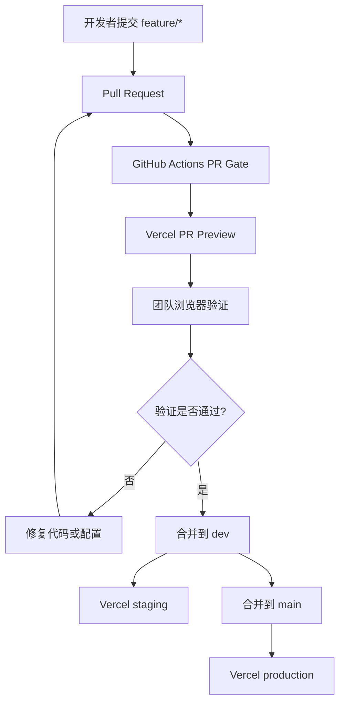
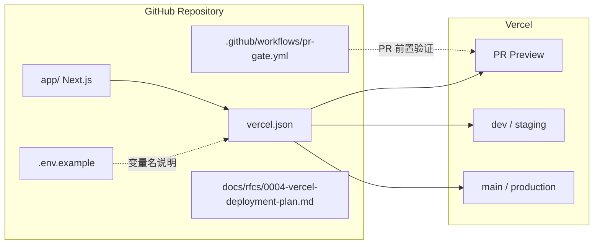
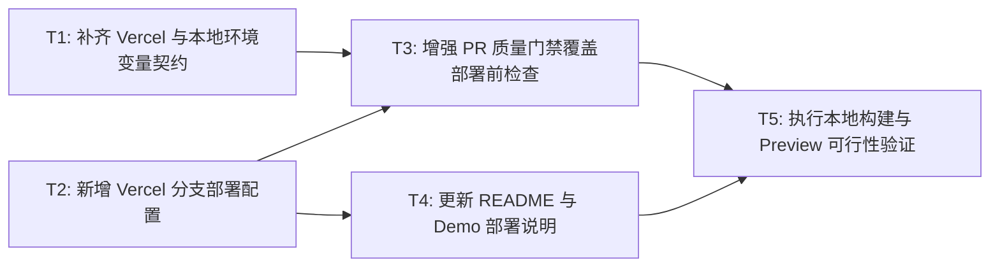

# RFC-0004: Vercel 分支部署与 Preview 流程

## 摘要

North Food 当前已经具备 Next.js 应用和基础 PR 门禁，但还没有一份把 Vercel 分支预览、main 生产部署、dev/staging 环境、环境变量与 CI 验证串起来的交付设计。本 RFC 的目标是让仓库在接入 Vercel 后，每次 Pull Request 都能自动生成可访问的 Preview URL，`dev` 分支可作为 staging 环境，`main` 分支作为 production 环境。当前方案只覆盖主应用部署，不把 Agent/NAC 部署纳入本次范围；真实密钥只允许放在 Vercel 环境变量中，仓库只保留占位说明和 `.env.example`。

## 动机

项目宪法要求 North Food 支持 Vercel branch preview deployment，并在 Demo 前确认最新 Preview URL 可打开。当前仓库已有 `app/` 下的 Next.js 应用、`Makefile` 本地命令和 `.github/workflows/pr-gate.yml` 基础 PR 门禁，但还缺少以下可执行约定：

1. Vercel 构建、安装和开发命令没有显式配置，团队需要依赖默认推断；
2. `main`、`dev`、PR Preview 的分支用途没有在仓库文档中固定；
3. 环境变量规则只写在原则中，缺少可提交的 `.env.example` 供本地和 Vercel 对齐；
4. 现有 PR 门禁只检查 RC 编号和合并冲突，没有在 PR 级别提醒部署前置质量检查；
5. README 的 Vercel 部署说明仍停留在 Next.js 模板默认文本，无法指导 Demo 前查看 Preview URL。

## 设计

### 用户看到的完整流程

1. 开发者在 `feature/*` 分支提交代码并打开 Pull Request。
2. GitHub Actions 在 PR 事件上运行质量门禁；门禁通过后才允许团队进入 Review 和合并。
3. Vercel 识别该 PR，并为 head 分支自动创建 Preview 部署。
4. 团队成员在 PR 页面查看 Vercel 生成的 Preview URL，用真实浏览器验证点餐、推荐、库存和订单流程。
5. 若 PR 合入 `dev`，Vercel 将该分支部署为 staging 环境，用于 Demo 前集成验证。
6. 若 PR 合入 `main`，Vercel 将 `main` 部署为 production 环境，用于最终交付。
7. 若 Preview 构建失败或页面无法访问，PR 作者需要先修复构建、环境变量或应用错误，再请求 Review。

### 概述

本 RFC 采用“平台托管 + 仓库声明”的方式接入 Vercel：仓库通过 `vercel.json` 声明 Next.js 项目根目录、安装命令、构建命令和开发命令；Vercel 根据 GitHub 分支和 PR 自动生成部署环境；仓库文档固定分支用途、环境变量规则和 Demo 前检查步骤。

### 概念模型

| 概念 | 说明 | 所有权 |
|---|---|---|
| 主应用 | `app/` 目录中的 Next.js 应用，是 Vercel 部署目标 | 仓库代码 |
| PR Preview | Vercel 为 Pull Request 自动创建的临时部署 URL | Vercel 平台 |
| staging 环境 | `dev` 分支对应的集成验证环境 | Vercel 平台 + 团队维护 |
| production 环境 | `main` 分支对应的最终交付环境 | Vercel 平台 + 团队维护 |
| 环境变量占位 | 可提交的变量名说明和示例值，不包含真实密钥 | 仓库文档 |
| 真实环境变量 | 部署时由 Vercel 注入的密钥、Token 或生产配置 | Vercel 平台 |

### 关键设计决策

#### 决策 1：Vercel 项目根目录指向 `app`

推荐默认值：`vercel.json` 声明 `outputDirectory` 外的 Next.js 默认构建流程，并通过 `installCommand`、`buildCommand`、`devCommand` 明确 `pnpm` 命令。

原因：

- 当前业务代码位于 `app/`，`app/package.json` 定义了 `dev`、`build`、`lint` 等脚本；
- 根目录没有 Next.js 项目，直接让 Vercel 部署仓库根目录会导致构建目标不明确；
- 显式声明命令可以降低平台默认推断带来的不确定性；
- 与项目宪法中“Next.js App Router + TypeScript + Vercel Preview”的交付方向一致。

#### 决策 2：分支用途固定为 PR Preview、dev/staging、main/production

推荐默认值：

- `feature/*` 或任意 PR 分支：Vercel PR Preview；
- `dev`：staging；
- `main`：production。

原因：

- 项目宪法要求每个 PR 自动生成 Vercel Preview URL；
- 用户已确认需要 `main + dev/staging`；
- `dev` 作为 staging 可以在合并到 `main` 前进行集成验证；
- `main` 作为 production 与 PR-only merge 规则一致。

#### 决策 3：真实密钥只存在于 Vercel 环境变量

推荐默认值：仓库只提交 `.env.example` 和变量名说明，不提交真实 API Key、Token、Cookie、数据库密码或生产密钥。

原因：

- 项目宪法明确禁止提交真实密钥；
- 当前主应用代码暂未发现直接读取敏感环境变量的逻辑，但后续 Agent/LLM 能力可能需要变量；
- 占位文件能让本地开发者和 Vercel 配置保持同一份变量名清单；
- `.gitignore` 已忽略 `.env*`，可继续防止 `.env.local` 被误提交。

#### 决策 4：PR 门禁只补充部署前检查提醒，不替代 Vercel 构建

推荐默认值：在现有 `.github/workflows/pr-gate.yml` 中增加一个轻量 job，运行 `pnpm install`、`pnpm typecheck`、`pnpm lint`、`pnpm test`、`pnpm build` 或等价命令；若项目尚未补齐 `typecheck` / `test` 脚本，则该子任务需要同时补齐脚本或明确当前可用命令。

原因：

- Vercel Preview 构建失败通常要到部署阶段才暴露，PR 作者反馈滞后；
- GitHub Actions 能在合并前给出更稳定的失败原因；
- 项目宪法要求 PR 必须通过 `pnpm install / typecheck / lint / test / build`；
- 门禁不应替代 Vercel，而是提前暴露同类问题。

#### 决策 5：本次不接入 NAC 或真实 Agent 部署

推荐默认值：本次 RFC 只保证主 Next.js 应用的 Vercel 部署；NAC/NexAU 部署、Agent 环境变量和云端 Agent 流程留在后续 RFC。

原因：

- 用户确认部署范围为“主应用部署”；
- 当前仓库中尚未发现主应用直接依赖 Agent 环境变量；
- 先完成 Vercel Preview 能降低 Demo 风险；
- 避免在部署 RFC 中引入额外平台、密钥和运行依赖。

### 接口契约

#### Vercel 配置契约

本 RFC 定义 Vercel 需要识别的部署入口和命令。具体 JSON 字段由实施阶段写入 `vercel.json`，但设计契约如下：

| 字段 | 含义 | 期望值 |
|---|---|---|
| `framework` | 告知 Vercel 使用 Next.js 构建流程 | `nextjs` |
| `installCommand` | 安装依赖命令 | `cd app && pnpm install` |
| `buildCommand` | 构建命令 | `cd app && pnpm build` |
| `devCommand` | 本地预览命令 | `cd app && pnpm dev` |
| `outputDirectory` | 构建产物目录 | 不显式覆盖 Next.js 默认值，除非实施验证需要 |

#### 分支部署契约

| 分支或事件 | Vercel 环境 | 用途 | 验证责任 |
|---|---|---|---|
| Pull Request | Preview | 单 PR 功能验证 | PR 作者和 Reviewer |
| `dev` | Staging | Demo 前集成验证 | 团队 |
| `main` | Production | 最终交付 | 团队负责人 |

#### 环境变量契约

仓库只提交变量名和示例值，不提交真实值。

| 变量名 | 环境 | 是否可提交真实值 | 说明 |
|---|---|---|---|
| `NODE_ENV` | Vercel 自动管理 | 否 | 由 Vercel 根据环境设置 |
| `NEXT_PUBLIC_APP_NAME` | 可提交示例 | 是示例值 | 用于前端展示应用名，若无实际使用可保留为空示例 |
| `NEXT_PUBLIC_SITE_URL` | 可提交示例 | 是示例值 | 本地和 Preview 可覆盖 |
| `AGENT_*` | 仅占位 | 否 | 后续接入 Agent/LLM 时使用，本次不启用 |

> 说明：如果实施阶段发现应用代码没有使用 `NEXT_PUBLIC_*` 变量，保留 `.env.example` 中的占位说明即可，不应为了让变量生效而新增无意义代码。

#### GitHub Actions 契约

现有 `.github/workflows/pr-gate.yml` 继续负责 RC 编号和合并冲突检查。本 RFC 新增或扩展的部署前置检查应满足：

| 检查项 | 触发条件 | 成功标准 | 失败表现 |
|---|---|---|---|
| 依赖安装 | PR 事件 | `pnpm install` 成功 | workflow 失败并输出错误日志 |
| 类型检查 | PR 事件 | `pnpm typecheck` 成功 | workflow 失败并输出错误日志 |
| Lint | PR 事件 | `pnpm lint` 成功 | workflow 失败并输出错误日志 |
| 测试 | PR 事件 | `pnpm test` 成功 | workflow 失败并输出错误日志 |
| 构建 | PR 事件 | `pnpm build` 成功 | workflow 失败并输出错误日志 |
| 禁止文件 | PR 事件 | 未发现手写 `.js` / `.jsx` / `.mjs` / `.cjs` / `.py` | workflow 失败并列出文件 |

### 架构图

## 权衡取舍

### 考虑过的替代方案

1. **只使用 Vercel 默认配置，不新增 `vercel.json`**
   - 优点：改动最少。
   - 缺点：项目根目录没有 Next.js 配置，Vercel 需要额外推断；命令和构建路径对团队成员不够透明。
   - 结论：不采用。为了 Demo 稳定性，应显式声明部署命令。

2. **只部署 `main`，不做 PR Preview 和 `dev/staging`**
   - 优点：配置最简单。
   - 缺点：无法在合并前通过真实 URL 验证页面；不满足项目宪法和本次用户要求。
   - 结论：不采用。

3. **把 NAC/Agent 部署也纳入本次 RFC**
   - 优点：一次设计完整 Agent 云端链路。
   - 缺点：范围扩大，需要额外认证、环境变量、日志和平台配置；本次用户明确选择主应用部署。
   - 结论：不采用，后续可单独 RFC。

4. **在 GitHub Actions 中模拟 Vercel 部署**
   - 优点：CI 更早发现部署问题。
   - 缺点：需要 Vercel CLI、Token 和额外权限，增加密钥管理复杂度。
   - 结论：本次不采用。先用 Vercel 原生 Preview 和常规构建命令覆盖主要风险。

### 缺点

- 本 RFC 只覆盖主 Next.js 应用，不能保证后续 Agent/NAC 部署一定可用。
- Vercel 的 Preview URL 由平台生成，仓库无法在本地完全模拟该 URL。
- 如果后续业务需要真实环境变量，团队必须在 Vercel 项目设置中补充，不能提交到仓库。
- 新增 GitHub Actions 构建检查会增加 PR 等待时间，但能降低合并后才发现构建失败的风险。

## 实现计划

### 阶段划分

- [ ] Phase 1: 补齐环境变量占位和部署配置声明，让 Vercel 明确知道如何构建 `app/`。
- [ ] Phase 2: 增强 PR 门禁，使 PR 合并前能提前暴露安装、类型检查、lint、测试、构建和禁止文件问题。
- [ ] Phase 3: 更新 README 和 Demo 文档，固定如何查看 PR Preview、staging 和 production。
- [ ] Phase 4: 执行本地验证，并记录 Vercel 配置接入后的手动检查清单。

### 子任务分解

#### 依赖关系图

#### 子任务列表

| ID | 标题 | 依赖 | Ref |
|----|------|------|-----|
| T1 | 补齐 Vercel 与本地环境变量契约 | - | - |
| T2 | 新增 Vercel 分支部署配置 | - | - |
| T3 | 增强 PR 质量门禁覆盖部署前检查 | T1, T2 | - |
| T4 | 更新 README 与 Demo 部署说明 | T2 | - |
| T5 | 执行本地构建与 Preview 可行性验证 | T3, T4 | - |

> **并行提示**: T1 和 T2 无依赖关系，可以由不同 agent 会话并行实现。

#### 子任务定义

**T1: 补齐 Vercel 与本地环境变量契约**
- **范围**: 新增或更新 `.env.example`，说明当前主应用部署所需变量名、示例值和禁止提交真实密钥的规则；确认 `.gitignore` 已忽略 `.env.local` 和 Vercel 本地元数据。
- **验收标准**: 仓库中存在可提交的 `.env.example`；不包含真实密钥；`.gitignore` 能防止 `.env.local` 被提交；README 能引用该文件。

**T2: 新增 Vercel 分支部署配置**
- **范围**: 新增根目录 `vercel.json`，声明 Next.js 框架、安装命令、构建命令、开发命令，并保证命令指向 `app/`。
- **验收标准**: `vercel.json` 是合法 JSON；Vercel 可根据该配置构建 `app/`；不包含真实环境变量或密钥；不引入 `.js` 或 `.py` 文件。

**T3: 增强 PR 质量门禁覆盖部署前检查**
- **范围**: 扩展 `.github/workflows/pr-gate.yml`，在现有 RC 编号和合并冲突检查之外，增加依赖安装、类型检查、lint、测试、构建和禁止文件检查。若当前 `app/package.json` 缺少 `typecheck` 或 `test` 脚本，应补齐脚本或等价命令。
- **验收标准**: PR 事件会运行质量检查；`pnpm typecheck`、`pnpm lint`、`pnpm test`、`pnpm build` 至少有一个明确命令路径；禁止文件检查覆盖 `.js`、`.jsx`、`.mjs`、`.cjs`、`.py`；workflow 失败时日志清晰。

**T4: 更新 README 与 Demo 部署说明**
- **范围**: 更新 `app/README.md` 或根目录 README，说明本地启动、Vercel 接入、PR Preview 查看、`dev` staging、`main` production、环境变量配置和 Demo 前检查步骤。
- **验收标准**: README 包含完整 Vercel 部署流程；包含如何查看当前 PR 的 Preview URL；说明真实密钥只能放在 Vercel；说明 Demo 前必须确认 Preview 可打开。

**T5: 执行本地构建与 Preview 可行性验证**
- **范围**: 在本地运行安装、类型检查、lint、测试、构建和禁止文件检查；在 Vercel 接入后确认 Preview、staging、production 的分支部署路径符合设计。
- **验收标准**: 本地质量命令通过或在 RFC/PR 中记录不可行原因；Vercel Preview URL 可访问；`dev` 和 `main` 的部署分支用途已验证或记录为手动验证项；未提交真实密钥。

### 影响范围

预计影响文件：

- `vercel.json` - 新增 Vercel 部署配置；
- `.env.example` - 新增环境变量占位说明；
- `.gitignore` - 确认或补充忽略 Vercel 本地元数据和环境变量；
- `.github/workflows/pr-gate.yml` - 增强 PR 质量门禁；
- `app/package.json` - 如缺少 `typecheck` / `test` 脚本，则补齐；
- `app/README.md` 或 `README.md` - 更新部署和 Demo 说明；
- `docs/rfcs/README.md` - 更新 RFC 索引。

不应影响：

- `app/app/page.tsx` - 主页面业务逻辑不应因部署 RFC 改变；
- `app/app/layout.tsx` - 布局不应因部署 RFC 改变；
- 业务订单、库存、Agent 边界 - 本 RFC 不修改业务状态流转。

## 测试方案

### 单元测试

本 RFC 主要涉及部署配置和 CI，不需要新增业务单元测试。若实施阶段为 `typecheck` 或 `test` 补齐脚本，应保持现有业务测试不变，并避免引入手写 `.js` 测试文件。

### 集成测试

实施阶段应验证以下命令路径：

1. `pnpm install` 能在 `app/` 下完成依赖安装；
2. `pnpm typecheck` 能完成 TypeScript 类型检查；
3. `pnpm lint` 能完成 ESLint 检查；
4. `pnpm test` 能运行项目测试；若当前没有测试文件，应明确当前测试脚本的行为；
5. `pnpm build` 能完成 Next.js 构建；
6. 禁止文件检查不会误报第三方依赖生成文件。

### 手动验证

Vercel 接入后按以下步骤验证：

1. 在 Vercel 中导入 GitHub 仓库，并确认项目根目录或配置使用仓库根目录中的 `vercel.json`；
2. 打开一个非 `main`、非 `dev` 的 PR 分支，确认 Vercel 生成 Preview URL；
3. 打开 Preview URL，验证 North Food 首页可加载；
4. 将变更合入 `dev` 后，确认 Vercel staging 部署更新；
5. 将变更合入 `main` 后，确认 Vercel production 部署更新；
6. 在 Vercel 项目设置中只配置真实环境变量，不把密钥写入仓库；
7. Demo 前记录最新 Preview 或 production URL，并用真实浏览器完成一次点餐流程。

## 未解决的问题

无。用户已确认本次范围为主应用部署、`main + dev/staging`、仅占位环境变量；Agent/NAC 部署和真实 Agent 环境变量预留均不纳入本次 RFC。

## 参考资料

- `AGENTS.md` - 项目级 Agent 行为宪法和 Vercel Preview 要求；
- `docs/development-constitution.md` - 团队开发宪法中的 Vercel 分支部署章节；
- `docs/rfcs/0001-site-constitution.md` - 现场开发宪法；
- `app/package.json` - 当前 Next.js 应用脚本；
- `.github/workflows/pr-gate.yml` - 当前 PR 门禁；
- [Vercel Next.js 部署文档](https://vercel.com/docs/deployments/overview)；
- [Next.js 部署文档](https://nextjs.org/docs/app/building-your-application/deploying)。
