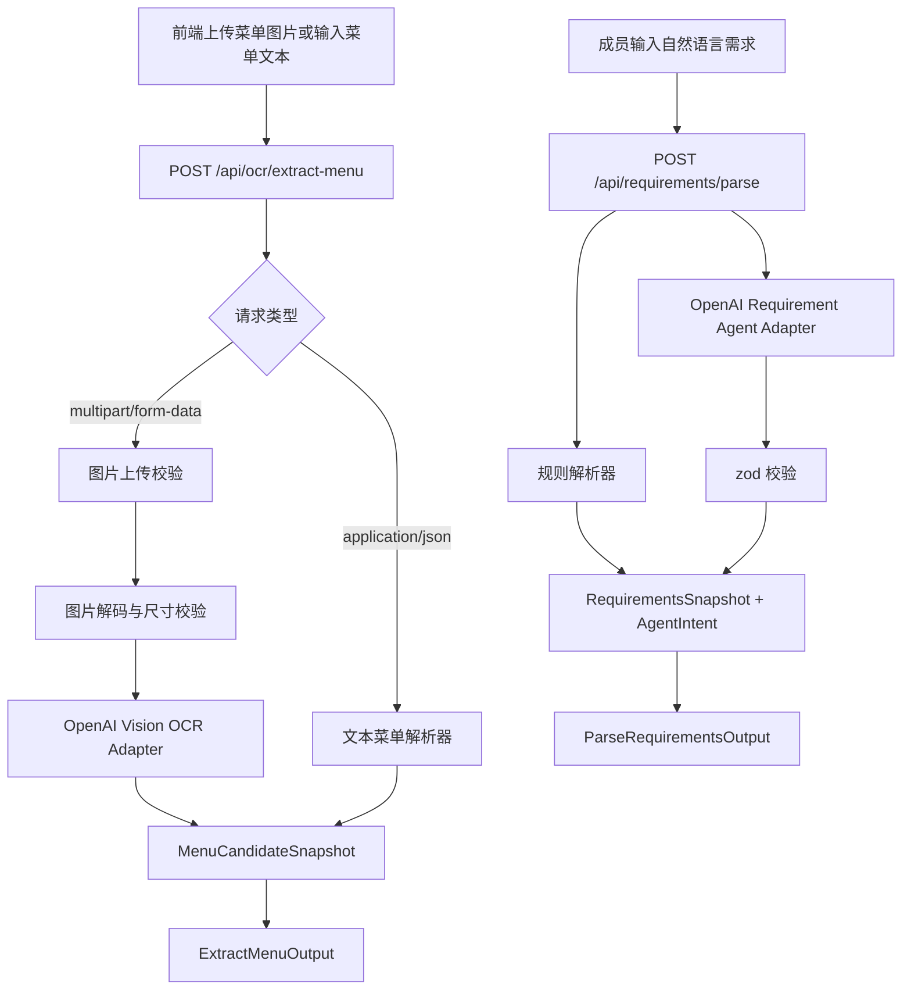
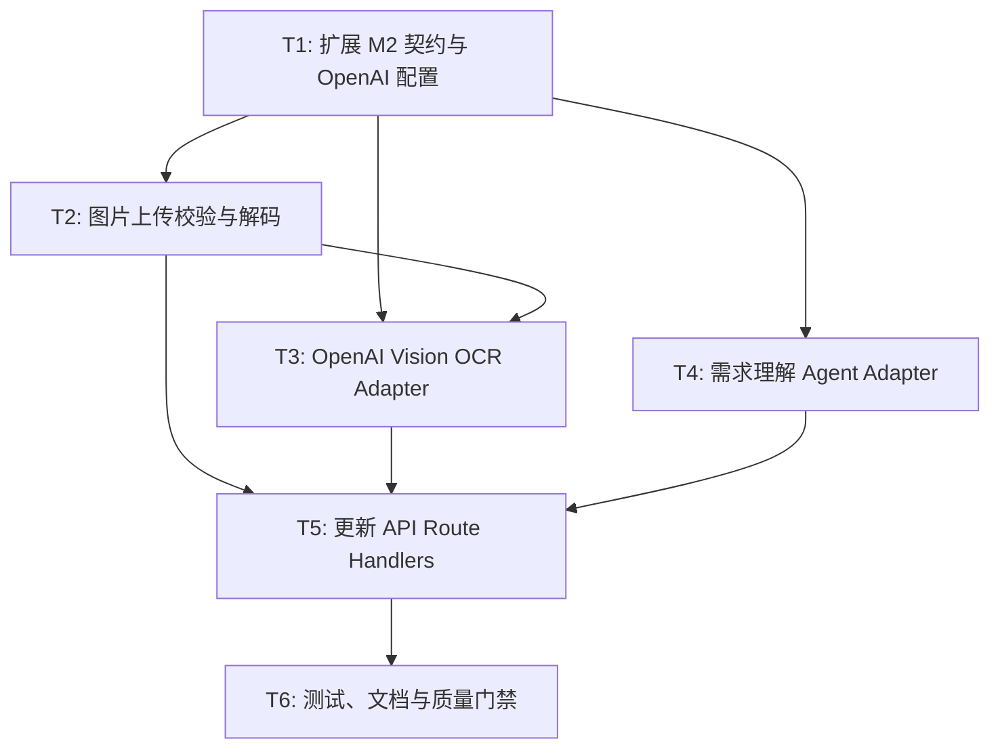

# RFC-0005: M2 图片 OCR 与 OpenAI 需求 Agent 能力

## 摘要

本 RFC 扩展 M2 的 OCR 与用户需求解析能力：在现有文本菜单解析和规则需求解析基础上，新增真实图片上传、图片解码校验、OpenAI Vision 菜单识别流程，以及成员自然语言需求的 OpenAI Agent 结构化解析。对外仍保持 M2 的边界：M2 只输出菜单候选、需求快照和 AgentIntent，不直接写菜单、订单、库存或需求状态。

本 RFC 选择 OpenAI Vision 作为默认图片 OCR 路线，复用同一个 `POST /api/ocr/extract-menu` 接口同时支持 JSON 文本输入和 `multipart/form-data` 图片上传；需求解析继续使用现有 `RequirementsSnapshot + AgentIntent` 契约，由 OpenAI Agent 输出结构化意图，后端用 `zod` 校验并保留规则解析降级路径。

## 动机

RFC-0003 已实现 M2 的文本菜单解析、需求规则解析和 AgentIntent 契约，但当前图片 OCR 仍是占位，需求理解也未接入 OpenAI Agent。这会带来两个问题：

1. **Demo 不完整**：真实菜单图片无法被识别为 `MenuCandidateSnapshot`，M2 无法展示“图片菜单 → 候选菜单”的完整链路。
2. **Agent 能力不足**：成员自然语言需求只靠规则解析，复杂表达、同义说法和未识别文本需要 Agent 补充，但现有实现没有标准 OpenAI 接口配置。

因此需要在不破坏 M2 边界的前提下，把图片识别和需求理解接入 OpenAI，同时控制密钥、成本、失败降级和部署稳定性。

## 设计

### 概述

M2 的新能力分为两条链路：

```text
图片菜单
  ↓
POST /api/ocr/extract-menu multipart/form-data
  ↓
图片上传校验 + 解码 + OpenAI Vision OCR
  ↓
MenuCandidateSnapshot
  → 交给 M1 展示和确认

成员自然语言需求
  ↓
POST /api/requirements/parse
  ↓
OpenAI Agent 结构化解析
  ↓
RequirementsSnapshot + AgentIntent
  → 交给后端规则层/M1 确认后处理
```

M2 仍不直接修改系统状态。图片 OCR 只输出菜单候选；需求 Agent 只输出结构化快照和意图候选；后端业务规则层或 M1 负责最终确认、写入和后续推荐/订单流程。

### 关键设计决策

#### 决策 1：图片 OCR 使用 OpenAI Vision

采用 OpenAI Vision 能力处理菜单图片，优先把图片转换为结构化菜单候选，而不是引入独立 OCR SDK 或本地图片识别服务。

原因：

- 项目已确定使用标准 OpenAI 接口配置；
- Vercel 部署中引入独立 OCR 服务或本地依赖风险较高；
- Vision 模型可同时完成文字识别、菜名/价格/类别/配料等结构化抽取；
- 便于后续替换模型或 adapter，而不改变 M2 对外契约。

#### 决策 2：同一接口同时支持文本和图片输入

`POST /api/ocr/extract-menu` 继续作为菜单提取入口：

- 原有 JSON 文本输入保持兼容；
- 新增 `multipart/form-data` 图片上传；
- 输出统一为 `ExtractMenuOutput`。

原因：

- 前端可以按“上传菜单图片”和“粘贴菜单文本”两种模式复用同一结果展示；
- 避免新增多个 OCR 入口导致 M1 集成成本增加；
- 保持 RFC-0003 已定义的 API 契约稳定。

#### 决策 3：Agent 只输出结构化意图

OpenAI 需求 Agent 不直接调用工具、不写状态、不扣库存、不创建订单。它只负责把成员自然语言转换为：

- `RequirementsSnapshot`
- `AgentIntent`
- `unresolvedTexts`
- 字段级置信度或低置信度说明（如 schema 允许）

后端必须用 `zod` 校验 Agent 输出；校验失败时返回结构化错误或降级到规则解析，不能把未校验的 Agent 文本当作业务事实。

原因：

- 符合项目 AGENTS.md 中“Agent 不得直接修改系统状态”的边界；
- 保留 M2 与 M1/M3 的契约边界；
- 便于测试、审计和失败降级。

#### 决策 4：标准 OpenAI 环境变量配置

OpenAI 调用通过标准环境变量读取配置：

- `OPENAI_API_KEY`：必需，Vercel 中配置真实密钥；
- `OPENAI_BASE_URL`：可选，兼容代理或自定义 OpenAI-compatible 服务；
- `OPENAI_MODEL`：可选，默认使用低成本 vision-capable 模型；
- `OPENAI_TIMEOUT_MS`：可选，默认设置合理超时；
- `OPENAI_MAX_IMAGE_BYTES`：可选，默认 5MB；
- `OPENAI_MAX_IMAGE_DIMENSION`：可选，默认用于限制过大的图片尺寸。

本地只提交 `.env.example` 或 README 中的变量说明，不提交真实密钥。

#### 决策 5：图片上传限制和失败降级

图片上传默认限制：

- 最大 5MB；
- 支持 `image/jpeg`、`image/png`、`image/webp`；
- 后端必须解码并校验 MIME、尺寸和文件大小；
- 超限或非法文件返回 400/413 结构化错误。

OpenAI 调用失败时：

- 返回结构化错误；
- 文本 OCR 链路继续可用；
- 前端提示“图片识别失败，可重试或粘贴菜单文本”；
- 不吞掉错误，不把失败结果伪装成低置信度成功。

### 概念模型

- **ImageMenuInput**：图片菜单上传输入，包含 `FormData` 中的图片文件。
- **DecodedImage**：后端解码后的图片对象，包含 MIME、字节数、尺寸和 base64/data URL 表示。
- **OpenAI Vision OCR Adapter**：把 `DecodedImage` 转换为 OpenAI 请求，并解析模型响应为 `MenuCandidateSnapshot`。
- **Requirement Agent Adapter**：把成员自然语言转换为 OpenAI 请求，并要求模型只输出 `ParseRequirementsOutput`。
- **Requirement Parser Orchestrator**：协调规则解析和 OpenAI Agent 解析，输出统一 `ParseRequirementsOutput`。
- **ExtractMenuOutput**：菜单解析输出，包含 `MenuCandidateSnapshot`。
- **ParseRequirementsOutput**：需求解析输出，包含 `RequirementsSnapshot` 和 `AgentIntent`。

关系：

```text
ImageMenuInput
  → ImageUploadValidator
  → DecodedImage
  → OpenAI Vision OCR Adapter
  → MenuCandidateSnapshot
  → ExtractMenuOutput

RequirementInput
  → Rule Requirement Parser
  → OpenAI Requirement Agent Adapter
  → RequirementsSnapshot + AgentIntent
  → ParseRequirementsOutput
```

### 模块地图

建议新增或修改以下模块：

```text
app/
  app/api/ocr/extract-menu/route.ts
  app/api/requirements/parse/route.ts
  src/ocr-requirement-agent/
    domain/
      image-ocr.ts
      openai-config.ts
    api/
      image-upload.ts
      m2-api-helpers.ts
    adapters/
      openai-vision-ocr-adapter.ts
      openai-requirement-agent-adapter.ts
    parser/
      menu-ocr-parser.ts
      requirement-parser.ts
    tests/
      image-upload.test.ts
      openai-vision-ocr-adapter.test.ts
      requirement-agent-adapter.test.ts
      api-routes.test.ts
  .env.example
```

边界规则：

- M2 不 import M1 菜单/订单/库存状态层；
- M2 不 import M3 方案生成模块；
- M2 不直接写菜单、需求、订单或库存；
- M2 不保存原始图片；
- M2 不把 OpenAI 输出直接暴露为最终事实，只输出候选和意图；
- 新增文件必须使用 TypeScript，不新增 `.js`、`.py` 文件。

### 接口契约

#### `POST /api/ocr/extract-menu`

**JSON 文本输入（保持兼容）**

```ts
type OcrInput = {
  mode: "text" | "image"
  content: string
}
```

**图片上传输入**

```text
Content-Type: multipart/form-data

field:
  name="file"
  type="image/jpeg | image/png | image/webp"
  max-size: 5MB
```

**输出（保持兼容）**

```ts
type ExtractMenuOutput = {
  snapshot: {
    source: "ocr" | "text"
    candidates: MenuItemInput[]
  }
}
```

#### `POST /api/requirements/parse`

**输入（保持兼容）**

```ts
type ParseRequirementsInput = {
  memberId: string
  text: string
}
```

**输出（保持兼容）**

```ts
type ParseRequirementsOutput = {
  snapshot: RequirementsSnapshot
  intent: AgentIntent
}
```

#### OpenAI 配置

```ts
type OpenAiConfig = {
  apiKey: string
  baseUrl?: string
  model: string
  timeoutMs: number
  maxImageBytes: number
  maxImageDimension?: number
}
```

### 架构图



## 权衡取舍

### 考虑过的替代方案

#### 方案 A：独立 OCR 服务

使用第三方 OCR 服务先提取文本，再复用现有文本菜单解析器。

拒绝原因：

- 增加外部服务和密钥配置数量；
- OCR 文本质量和菜单结构化质量之间仍需额外解析；
- 与用户选择的 OpenAI 标准接口方向不一致。

#### 方案 B：独立图片接口

新增 `POST /api/ocr/extract-image`，与文本接口分离。

拒绝原因：

- M1 集成需要处理两个入口；
- 输出契约相同，分离接口收益有限；
- 同一接口按 Content-Type 分派更贴近真实上传流程。

#### 方案 C：Agent 直接调用工具修改状态

让 OpenAI Agent 通过工具直接写入需求、菜单或订单状态。

拒绝原因：

- 违反项目 Agent 行为边界；
- 容易绕过库存、订单状态和预算规则；
- 不利于审计和测试。

### 缺点

- OpenAI 调用有成本和延迟，需要超时和错误处理；
- Vision 模型识别结果可能存在菜名、价格或配料误识别，需要通过置信度和低置信度字段暴露；
- 图片上传会增加后端解析和校验复杂度；
- 真实密钥只能放在 Vercel 环境变量中，本地 Demo 需要配置 `.env.local`。

## 实现计划

### 阶段划分

1. 先扩展 M2 领域契约和 OpenAI 配置；
2. 再实现图片上传校验、解码和 OpenAI Vision OCR adapter；
3. 然后实现需求理解 Agent adapter 和规则解析协调；
4. 最后更新 API route、测试和 README。

### 子任务分解

#### 依赖关系图



#### 子任务列表

| ID | 标题 | 依赖 | Ref |
|---|---|---|---|
| T1 | 扩展 M2 契约与 OpenAI 配置 | 无 |  |
| T2 | 实现图片上传校验与解码 | T1 |  |
| T3 | 实现 OpenAI Vision OCR Adapter | T1, T2 |  |
| T4 | 实现需求理解 Agent Adapter | T1 |  |
| T5 | 更新 M2 API Route Handlers | T2, T3, T4 |  |
| T6 | 补充测试、README 与质量门禁 | T5 |  |

#### 子任务定义

##### T1：扩展 M2 契约与 OpenAI 配置

范围：

- 在 `domain` 中补充图片 OCR、OpenAI 配置、图片识别错误等类型；
- 定义标准环境变量读取规则；
- 明确默认模型、超时和文件大小限制。

验收标准：

- 类型严格，不使用 `any` 或 `as any`；
- 配置读取有本地默认值；
- 不提交真实密钥。

##### T2：实现图片上传校验与解码

范围：

- 支持 `multipart/form-data` 图片上传；
- 校验 MIME、大小和尺寸；
- 解码为 OpenAI 可接受的图片表示；
- 非法请求返回结构化 400/413 错误。

验收标准：

- 5MB、jpeg/png/webp 限制生效；
- 非图片、超大文件和损坏图片不会进入 OpenAI 调用；
- 单元测试覆盖主要校验分支。

##### T3：实现 OpenAI Vision OCR Adapter

范围：

- 调用 OpenAI Vision 模型识别菜单图片；
- 要求模型输出 `MenuCandidateSnapshot`；
- 使用 `zod` 校验模型输出；
- 保留 raw OCR 文本或低置信度字段用于调试展示。

验收标准：

- 成功路径输出 `MenuCandidateSnapshot`；
- 模型输出不符合 schema 时返回结构化错误；
- adapter 可被 mock 测试，不依赖真实 OpenAI 密钥。

##### T4：实现需求理解 Agent Adapter

范围：

- 将成员自然语言输入发送给 OpenAI Agent；
- 要求模型输出 `ParseRequirementsOutput`；
- 后端用 `zod` 校验输出；
- 与规则解析器协调，保留 `unresolvedTexts`。

验收标准：

- Agent 只输出结构化快照和意图；
- 不写状态、不调用订单/库存/菜单状态层；
- schema 失败时有明确错误或降级策略。

##### T5：更新 M2 API Route Handlers

范围：

- 更新 `POST /api/ocr/extract-menu` 支持图片和文本分派；
- 更新 `POST /api/requirements/parse` 支持规则解析 + Agent 解析协调；
- 保持 GET/PUT/PATCH/DELETE/OPTIONS 方法响应；
- 错误响应包含稳定 code 和 message。

验收标准：

- 原有 JSON 文本菜单解析继续可用；
- 图片上传返回统一 `ExtractMenuOutput`；
- 需求解析返回统一 `ParseRequirementsOutput`；
- 不引入业务状态副作用。

##### T6：补充测试、README 与质量门禁

范围：

- 补充图片上传、OpenAI adapter、需求 Agent adapter 和 API route 测试；
- 更新 `app/README.md` 的本地 OpenAI 配置说明；
- 运行 `pnpm typecheck`、`pnpm lint`、`pnpm test`、`pnpm build`。

验收标准：

- 质量门禁通过；
- README 说明 `.env.local` 与 Vercel 环境变量；
- 没有新增 `.js`、`.py` 文件。

### 影响范围

- `app/app/api/ocr/extract-menu/route.ts`
- `app/app/api/requirements/parse/route.ts`
- `app/src/ocr-requirement-agent/domain/index.ts`
- `app/src/ocr-requirement-agent/api/m2-api-helpers.ts`
- `app/src/ocr-requirement-agent/parser/menu-ocr-parser.ts`
- `app/src/ocr-requirement-agent/parser/requirement-parser.ts`
- `app/src/ocr-requirement-agent/tests/*`
- `app/README.md`
- `app/.env.example`（如项目约定允许提交示例环境变量）

## 测试方案

- **单元测试**：
  - 图片大小、MIME、尺寸校验；
  - OpenAI Vision OCR adapter 的 mock 成功和失败路径；
  - 需求 Agent adapter 的 schema 校验成功和失败路径；
  - 规则解析与 Agent 解析协调逻辑。
- **API 测试**：
  - JSON 文本菜单解析保持兼容；
  - `multipart/form-data` 图片上传成功路径；
  - 非法图片、超大文件、损坏图片错误路径；
  - 需求解析成功路径和 Agent schema 失败路径。
- **质量门禁**：
  - `pnpm typecheck`
  - `pnpm lint`
  - `pnpm test`
  - `pnpm build`
- **手动 Demo**：
  - 上传一张菜单图片，确认输出候选菜单；
  - 粘贴菜单文本，确认旧链路仍可用；
  - 输入“不吃猪肉，花生过敏，想吃微辣”，确认输出 `RequirementsSnapshot + AgentIntent`；
  - 关闭 OpenAI 密钥或模拟超时，确认返回结构化错误且文本链路可用。

## 未解决的问题

无。

## 参考资料

- `docs/rfcs/0003-m2-ocr-requirement-agent.md`
- `docs/rfcs/0004-vercel-deployment-plan.md`
- `AGENTS.md`
- `docs/development-constitution.md`
