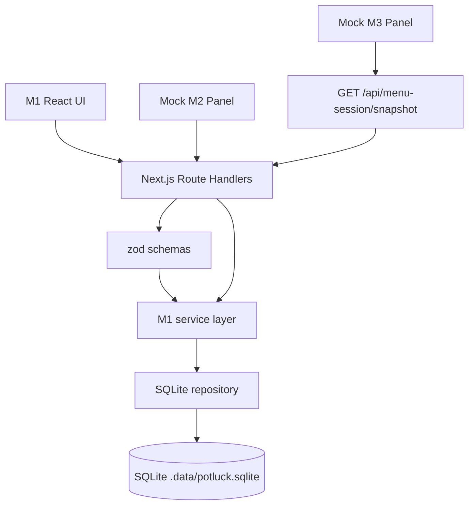
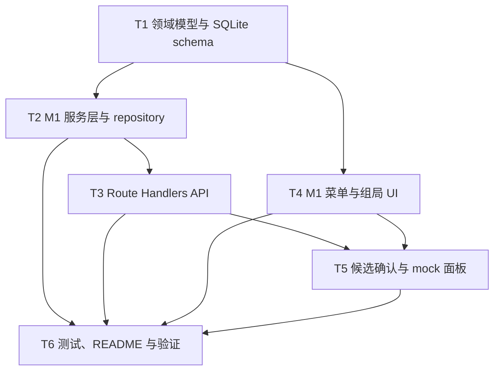

# RFC-0006: M1 菜单与组局模块实现

## 摘要

本 RFC 设计并拆分 M1「菜单与组局前后端模块」的实现范围。M1 负责维护真实可用的菜单与组局状态，提供 Next.js Route Handlers API、SQLite 持久化、菜单 CRUD、组局 CRUD、M2 菜单候选逐项确认，以及可被 M3 消费的 `MenuSessionSnapshot`。

为满足 Demo 集成需要，本 RFC 还包含一个可操作的本地 mock 面板：它模拟 M2 输出 `MenuCandidateSnapshot` 与 M3 输入/输出相关展示，但不实现真实 OCR、真实 Agent 或方案生成逻辑。所有写菜单与组局状态的动作都必须经过 M1 后端服务与运行时校验，mock 面板只负责产生可确认的候选数据。

## 动机

`docs/potluck-overview-design.md` 将 Potluck 系统拆为三个并行模块：M1 菜单与组局、M2 OCR 与用户需求 Agent、M3 方案生成与解释 Agent。M1 是后续模块集成前必须落地的基础状态层，因为它维护真实菜单、预算、人数、成员与打包标记，并输出 `MenuSessionSnapshot`。

当前仓库仍是 Next.js 初始项目，缺少菜单、组局、API、持久化与 Demo UI。若直接并行开发 M2/M3，会缺少稳定输入来源和可验证的业务状态。因此需要先实现 M1，并补上一个可操作 mock 面板，使团队能在真实前端流程中验证固定 Demo 路径。

## 设计

### 概述

M1 采用“领域模型 + repository + Route Handlers + React UI”的结构。业务状态由 SQLite 持久化，所有外部输入进入 API 后先经过 `zod` schema 校验，再交由服务层写入 repository。前端通过普通 `fetch` 调用 API，避免 Server Action 与业务状态耦合过深。

M1 的核心流程如下：

1. 用户打开 Potluck Demo 页面，进入 M1 菜单与组局面板。
2. 用户可以创建、编辑、删除菜单项，也可以粘贴文本菜单生成初始候选。
3. M1 展示 M2 mock 生成的菜单候选，用户逐项确认字段后写入真实菜单。
4. 用户可以设置预算、人数、成员和打包标记，保存为当前组局。
5. M3 mock 面板调用 `GET /api/menu-session/snapshot` 展示 M1 输出的快照。
6. 后续真实 M2/M3 只需替换 mock 面板，不需要修改 M1 的 API 契约。

### 概念模型

- `MenuItem`：系统真实可用的菜品。包含名称、价格、品类、辣度、食材、过敏原标记、素食标记、建议份数、置信度、已确认字段等。
- `MenuItemInput`：创建或更新菜单项时的输入契约。允许字段省略，由服务层补默认值。
- `MenuCandidate`：由 M2 或 mock M2 产生的候选菜品，尚未成为真实菜单。
- `MealSession`：当前组局状态。包含预算、人数、成员、打包标记、优惠信息等。
- `Member`：组局成员。包含 id、姓名、是否需要打包等。
- `MenuSessionSnapshot`：M1 对外输出的集成快照，由 `menu` 与 `session` 组成，供 M3 消费。

模块边界：

- M1 是唯一维护真实菜单和组局状态的模块。
- M2 只输出候选，不直接写菜单。
- M3 只消费快照，不读取 M1 内部 repository。
- 本地 mock M2/M3 不绕过 M1 API 写状态。

### 关键设计决策

#### 1. 使用真实 SQLite 持久化

M1 使用 SQLite 保存菜单与组局状态，而不是内存状态或 localStorage。这样本地 Demo 在刷新页面后仍保留数据，也更接近真实业务系统。

实现上优先选择 `better-sqlite3` 搭配 `drizzle-orm`：

- `better-sqlite3` 提供本地同步 SQLite 访问，适合 Next.js Route Handlers 中的服务端调用。
- `drizzle-orm` 提供 TypeScript 类型、schema 与迁移友好性。
- 数据库文件建议放在 `app/.data/potluck.sqlite`，并通过 `.gitignore` 忽略。

需要在实现阶段验证 `better-sqlite3` 的 native 依赖是否能在当前 CI 与 Vercel 环境中稳定安装和构建。如果验证失败，应保留 M1 API 与 UI 契约不变，将 repository 替换为兼容的状态层，而不是改变对外接口。

#### 2. Route Handlers 作为 M1 API 边界

M1 API 使用 Next.js App Router Route Handlers，而不是 Server Actions。原因是：

- Route Handlers 暴露稳定 HTTP 契约，便于 M2/M3 或 mock 面板独立调用。
- API 路径与 `docs/potluck-overview-design.md` 中的接口汇总保持一致。
- 测试和集成更直观，后续可替换为真实服务调用。

M1 需要实现以下 API：

| 方法 | 路径 | 说明 |
|---|---|---|
| `POST` | `/api/menu/items` | 创建菜单项 |
| `PATCH` | `/api/menu/items/:id` | 更新菜单项 |
| `DELETE` | `/api/menu/items/:id` | 删除菜单项 |
| `POST` | `/api/menu/candidates/confirm` | 用户逐项确认菜单候选并写入真实菜单 |
| `POST` | `/api/session` | 创建或替换当前组局 |
| `PATCH` | `/api/session/:id` | 更新组局 |
| `GET` | `/api/menu-session/snapshot` | 输出 `MenuSessionSnapshot` |

#### 3. M2 菜单候选必须逐项确认

M2 mock 可以生成候选菜品，但候选不会自动成为真实菜单。M1 提供候选确认 UI 与 `POST /api/menu/candidates/confirm`，用户逐项检查并确认后，M1 才把候选转换为 `MenuItem`。

确认接口输入保留候选字段，并在服务端补齐默认值：

- `id` 由 M1 生成，不信任客户端传入的 id。
- `confidence` 默认为 mock 或 M2 提供的值，缺失时设为 `0.5`。
- `confirmedFields` 记录本次确认的字段；未确认字段不进入真实菜单。
- 价格必须为非负数字，名称不能为空。

#### 4. 本地 mock 面板只模拟输入输出，不模拟真实 Agent 能力

本 RFC 包含可操作的本地 mock M2/M3 面板，用于跑通固定 Demo 路径：

- mock M2：根据示例文本生成 `MenuCandidateSnapshot` 与 `RequirementsSnapshot` 的本地展示。
- mock M3：展示 `PlanningInputSnapshot`、`PlanResult`、`ExplanationSnapshot`、`PlanDiff` 的固定样例，并从 M1 snapshot 拼接输入。

mock 面板必须明确标注“Mock”，不得伪装为真实 OCR 或真实 Agent。它只能帮助 M1 集成验证，不能成为后续真实 Agent 的最终实现。

#### 5. 运行时校验与 TypeScript 严格模式

M1 的所有输入契约使用 `zod` 建模并校验。实现时需要补齐项目质量门禁：

- `strict: true`
- `noImplicitAny: true`
- `strictNullChecks: true`
- `exactOptionalPropertyTypes: true`
- `noUncheckedIndexedAccess: true`
- `noFallthroughCasesInSwitch: true`
- `noUnusedLocals: true`
- `noUnusedParameters: true`
- `useUnknownInCatchVariables: true`

API 响应统一返回结构化结果，避免把异常栈直接暴露给前端。

### 接口契约

#### `MenuItem`

```ts
type MenuItem = {
  id: string
  name: string
  price: number
  category?: string
  spiciness?: string
  ingredients: string[]
  containsPork: boolean
  containsBeef: boolean
  containsChicken: boolean
  containsSeafood: boolean
  containsPeanut: boolean
  containsEgg: boolean
  containsDairy: boolean
  isVegetarian: boolean
  suggestedServings: number
  confidence: number
  confirmedFields: string[]
}
```

#### `MenuItemInput`

```ts
type MenuItemInput = {
  id?: string
  name: string
  price: number
  category?: string
  spiciness?: string
  ingredients?: string[]
  containsPork?: boolean
  containsBeef?: boolean
  containsChicken?: boolean
  containsSeafood?: boolean
  containsPeanut?: boolean
  containsEgg?: boolean
  containsDairy?: boolean
  isVegetarian?: boolean
  suggestedServings?: number
  confidence?: number
  confirmedFields?: string[]
}
```

#### `Member`

```ts
type Member = {
  id: string
  name: string
  needsTakeout: boolean
}
```

#### `MealSession`

```ts
type MealSession = {
  id: string
  budget: number
  memberCount: number
  members: Member[]
  promotions: string[]
}
```

#### `MenuSessionSnapshot`

```ts
type MenuSessionSnapshot = {
  menu: MenuItem[]
  session: MealSession
}
```

#### `MenuCandidateSnapshot`

```ts
type MenuCandidateSnapshot = {
  source: "ocr" | "text" | "mock"
  candidates: MenuItemInput[]
}
```

#### `ConfirmMenuCandidateInput`

```ts
type ConfirmMenuCandidateInput = {
  candidate: MenuItemInput
  confirmedFields: string[]
}
```

### 架构图



## 权衡取舍

### 考虑过的替代方案

#### 方案 A：内存状态 + fixture

优点：实现最快，不引入依赖，Vercel 构建最稳定。  
缺点：刷新页面后状态丢失，无法体现真实业务系统状态持久化，也不利于 Demo 连续演示。

结论：不采用。用户已明确要求真实 SQLite 持久化。

#### 方案 B：Server Actions

优点：组件调用更直接，代码量较少。  
缺点：跨模块 HTTP 契约不如 Route Handlers 清晰，后续 M2/M3 集成时需要额外适配。

结论：不采用。M1 需要稳定 API 边界，Route Handlers 更合适。

#### 方案 C：只做 M1，不实现 mock 面板

优点：范围更小，M1 可更快完成。  
缺点：无法验证固定 Demo 路径，M2/M3 并行开发缺少可操作的集成入口。

结论：不采用。本次选择实现可操作 mock 面板。

### 缺点

- 引入 `better-sqlite3` native 依赖后，需要额外验证本地、CI 与 Vercel 构建稳定性。
- Route Handlers 相比 Server Actions 会引入更多 API 层代码。
- mock 面板可能让 Demo 看起来接近完整系统，但必须明确标注它不是真实 Agent。
- SQLite 文件需要妥善处理 `.gitignore` 与本地初始化，避免误提交数据库文件。

## 实现计划

### 阶段划分

1. 建立 M1 领域模型、schema 与 SQLite repository。
2. 并行推进 M1 服务层/repository 与 M1 菜单组局 UI。
3. 在 T2 完成后实现 M1 Route Handlers 与错误响应。
4. 在 T4 基础上实现 M2 菜单候选逐项确认流程。
5. 实现本地 mock M2/M3 面板与固定 Demo 路径。
6. 补充测试、README 与质量门禁验证。

### 子任务分解

#### 依赖关系图



#### 子任务列表

| ID | 标题 | 依赖 | Ref |
|---|---|---|---|
| T1 | 建立 M1 领域模型、zod schema 与 SQLite schema | 无 |  |
| T2 | 实现菜单、组局与 snapshot 服务层 | T1 |  |
| T3 | 实现 M1 Route Handlers API | T2 |  |
| T4 | 实现 M1 菜单与组局 UI | T1 |  |
| T5 | 实现候选确认与本地 mock M2/M3 面板 | T3, T4 |  |
| T6 | 补充测试、README 与质量门禁验证 | T2, T3, T4, T5 |  |

#### 子任务定义

##### T1 建立 M1 领域模型、zod schema 与 SQLite schema

范围：

- 在 `app/src/menu-session/domain` 下定义 `MenuItem`、`MenuItemInput`、`MealSession`、`Member`、`MenuSessionSnapshot`、`MenuCandidateSnapshot` 等类型。
- 在 `app/src/menu-session/schemas` 下定义 `zod` 输入校验 schema。
- 在 `app/src/menu-session/db/schema.ts` 下定义 SQLite 表结构。
- 创建数据库初始化入口，确保本地 `.data/potluck.sqlite` 存在。

验收标准：

- TypeScript strict 类型检查通过。
- schema 能覆盖必填字段、数字范围、数组默认值与布尔默认值。
- 数据库 schema 与领域模型字段一致。

##### T2 实现菜单、组局与 snapshot 服务层

范围：

- 实现 `MenuRepository`、`SessionRepository` 与 SQLite repository。
- 实现菜单创建、更新、删除、查询服务。
- 实现组局创建、更新、查询服务。
- 实现 `getMenuSessionSnapshot()`。
- 实现候选菜单到真实菜单项的转换逻辑。

验收标准：

- 服务层不依赖 React 组件或 Route Handlers。
- 写入菜单必须校验字段并生成稳定 id。
- 删除菜单项不会破坏组局数据。
- snapshot 输出符合 M3 输入契约。

##### T3 实现 M1 Route Handlers API

范围：

- 创建 `/api/menu/items`、`/api/menu/items/[id]`、`/api/menu/candidates/confirm`、`/api/session`、`/api/session/[id]`、`/api/menu-session/snapshot` Route Handlers。
- 统一错误响应格式。
- 对 `POST`、`PATCH`、`DELETE` 输入执行 `zod` 校验。

验收标准：

- API 路径与 RFC 表格一致。
- 无效输入返回 400，不抛出未处理异常。
- 成功响应返回结构化 JSON。
- 可通过 curl 或测试脚本验证基本 CRUD。

##### T4 实现 M1 菜单与组局 UI

范围：

- 在首页或 Potluck 页面中接入 M1 菜单面板。
- 提供菜单项列表、创建表单、编辑表单、删除操作。
- 提供组局表单：预算、人数、成员、打包标记。
- 展示当前 `MenuSessionSnapshot` 摘要。

验收标准：

- 用户可在页面完成菜单 CRUD。
- 用户可保存预算 250、4 人、成员 A/B/C/D。
- 页面刷新后数据仍保留。
- UI 不直接调用 repository，只通过 API 改变状态。

##### T5 实现候选确认与本地 mock M2/M3 面板

范围：

- 实现 `POST /api/menu/candidates/confirm` 的前端逐项确认 UI。
- 实现本地 mock M2 面板：从示例文本生成菜单候选，并提交给 M1 确认。
- 实现本地 mock M3 面板：调用 M1 snapshot，展示 `PlanningInputSnapshot`、`PlanResult`、`ExplanationSnapshot`、`PlanDiff` 示例。
- 在 UI 中明确标注 mock 数据来源。

验收标准：

- 用户可以逐项确认候选菜单。
- 未确认字段不会写入真实菜单。
- mock M3 能展示 M1 当前 snapshot 拼接出的计划输入。
- mock 面板不直接写菜单、组局、订单或库存。

##### T6 补充测试、README 与质量门禁验证

范围：

- 补充服务层或 API 层测试。
- 补充关键 UI 或集成测试。
- 更新 `app/README.md`，说明本地启动、SQLite 初始化、Demo 脚本与 Vercel 注意事项。
- 运行 `pnpm install`、`pnpm typecheck`、`pnpm lint`、`pnpm test`、`pnpm build` 或项目等价命令。

验收标准：

- 类型检查、lint、测试、build 均通过。
- README 包含固定 Demo 步骤。
- 不产生 `.js`、`.jsx`、`.mjs`、`.cjs`、`.py` 手写文件。
- 数据库文件未提交。

### 影响范围

预期新增或修改的文件/目录：

- `app/src/menu-session/domain/*`
- `app/src/menu-session/schemas/*`
- `app/src/menu-session/db/*`
- `app/src/menu-session/service/*`
- `app/app/api/menu/*`
- `app/app/api/session/*`
- `app/app/api/menu-session/snapshot/route.ts`
- `app/components/*`
- `app/app/page.tsx`
- `app/README.md`
- `app/package.json`
- `app/tsconfig.json`（如需要补齐严格模式）
- `app/.gitignore`（如需要补充 `.data/`）

本 RFC 不修改真实 M2/M3 Agent 实现，不引入订单或库存写状态逻辑。

## 测试方案

### 单元与集成测试

- `MenuItemInput` schema：验证必填字段、默认值、非法价格、非法布尔值。
- 菜单服务：创建、更新、删除、查询菜单项。
- 组局服务：创建、更新、查询组局。
- 候选确认服务：确认字段映射、默认值补齐、非法候选拒绝。
- snapshot 服务：菜单与组局组合输出符合 `MenuSessionSnapshot`。
- API handler：无效输入返回 400，成功路径返回结构化 JSON。

### 前端验证

- 菜单 CRUD：创建、编辑、删除后列表刷新。
- 组局 CRUD：预算、人数、成员、打包标记保存后刷新仍保留。
- 候选确认：逐项确认只写入已确认字段。
- mock M2：示例文本能生成候选并提交确认。
- mock M3：能读取 M1 snapshot 并展示固定样例。

### 质量门禁

实现完成后运行：

```bash
cd app
pnpm install
pnpm typecheck
pnpm lint
pnpm test
pnpm build
```

如果项目尚未配置 `typecheck` 或 `test`，需要在 `package.json` 中补充等价脚本，例如 `tsc --noEmit` 与 Vitest。

## 未解决的问题

无。

## 参考资料

- `docs/potluck-overview-design.md`
- `AGENTS.md`
- `docs/development-constitution.md`
